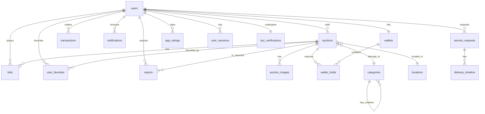

# Rapport d'Analyse Complet — MazadPay Backend (Go)


---

## 2. Fonctionnalités Extraites — Inventaire Exhaustif

### 🔐 F1 — Authentification & Onboarding

| ID    | Fonctionnalité                                       | Source                                  | Endpoint Backend                  |
| :---- | :--------------------------------------------------- | :-------------------------------------- | :-------------------------------- |
| F1.1  | Splash Screen animé                                  | `main.dart`                             | — (Frontend only)                 |
| F1.2  | Onboarding (carrousel introductif)                   | `start_bidding_page.dart`               | — (Frontend only)                 |
| F1.3  | Sélection de langue (Arabe / Français / English)     | `language_page.dart`, `app_modals.dart` | `PUT /api/users/me/language`      |
| F1.4  | Acceptation Termes & Conditions                      | `terms_page.dart`                       | `POST /api/users/me/accept-terms` |
| F1.5  | Inscription par numéro de téléphone + PIN 4 chiffres | `login_page.dart`                       | `POST /api/auth/register`         |
| F1.6  | Connexion par téléphone + PIN                        | `login_page.dart`                       | `POST /api/auth/login`            |
| F1.7  | Sélection du pays (code +222 Mauritanie)             | `login_page.dart`                       | Validation côté serveur           |
| F1.8  | Envoi OTP via SMS (Termii)                           | `otp_entry_page.dart`                   | `POST /api/auth/otp/send`         |
| F1.9  | Vérification OTP (6 chiffres, timer pour renvoi)     | `otp_entry_page.dart`                   | `POST /api/auth/otp/verify`       |
| F1.10 | Mot de passe oublié (reset via OTP)                  | `login_page.dart`                       | `POST /api/auth/reset-password`   |
| F1.11 | Déconnexion                                          | `account_profile_page.dart`             | `POST /api/auth/logout`           |

> [!IMPORTANT]
> **Service SMS/OTP — Termii** : Le fournisseur retenu pour l'envoi des OTP par SMS est **[Termii](https://termii.com)**.
> - **Endpoint Termii** : `POST {BASE_URL}/api/sms/otp/send`
> - **Paramètres clés** : `api_key`, `to` (format international ex: `2222XXXXXXXX`), `from` (Sender ID enregistré), `channel` (`generic`), `pin_type` (`NUMERIC`), `pin_length` (6), `pin_time_to_live` (5 min), `pin_attempts` (3).
> - **Vérification** : `POST {BASE_URL}/api/sms/otp/verify` avec `pin_id` + `pin` saisi par l'utilisateur.
> - Le `pin_id` retourné par Termii est stocké temporairement (Redis ou table `otp_verifications`) pour la vérification ultérieure.
> - Rate-limit : **3 tentatives max**, blocage **15 min** après échec.
> - Le canal SMS couvre le réseau mauritanien (+222).

---

### 🏠 F2 — Page d'Accueil & Navigation

| ID    | Fonctionnalité                                           | Source                                                      | Endpoint Backend                       |
| :---- | :------------------------------------------------------- | :---------------------------------------------------------- | :------------------------------------- |
| F2.1  | Bannières promotionnelles (carrousel)                    | `home_page.dart` L67-82                                     | `GET /api/banners`                     |
| F2.2  | Filtre par ville (Nouakchott / Nouadhibou)               | `home_page.dart` L83-104                                    | `GET /api/auctions?city=...`           |
| F2.3  | Liste d'enchères actives avec cards                      | `home_page.dart` L340-420                                   | `GET /api/auctions?status=active`      |
| F2.4  | Indicateur "LIVE" animé                                  | `live_indicator.dart`                                       | Champ `status` dans la réponse auction |
| F2.5  | Barre de recherche                                       | `home_page.dart` L110-130                                   | `GET /api/auctions/search?q=...`       |
| F2.6  | Navigation Bottom Bar (4 tabs + FAB central)             | `home_page.dart`, `services_page.dart`, `account_page.dart` | — (Frontend routing)                   |
| F2.7  | Menu latéral (Side Drawer) avec profil                   | `side_menu_drawer.dart`                                     | `GET /api/users/me`                    |
| F2.8  | Liens réseaux sociaux (Facebook, Insta, TikTok, Snap)    | `side_menu_drawer.dart` L268-275                            | — (liens statiques)                    |
| F2.9  | Partage de l'application                                 | `side_menu_drawer.dart` L233-246                            | — (Deep link)                          |
| F2.10 | Bouton "Évaluer l'app" (noter 1-5 étoiles + commentaire) | `app_modals.dart` L111-217                                  | `POST /api/ratings`                    |
| F2.11 | **Signalement d'annonce (Report)**                       | Nouvel ajout                                                | `POST /api/auctions/{id}/report`       |


---

### 🔨 F3 — Système d'Enchères (Core Business)

| ID    | Fonctionnalité                                                          | Source                                               | Endpoint Backend                        |
| :---- | :---------------------------------------------------------------------- | :--------------------------------------------------- | :-------------------------------------- |
| F3.1  | Fiche détaillée d'enchère (galerie images, description)                 | `auction_details_page.dart`                          | `GET /api/auctions/{id}`                |
| F3.2  | Compte à rebours temps réel (H:M:S)                                     | `auction_details_page.dart` L350-400                 | WebSocket `/ws/auction/{id}`            |
| F3.3  | Compteur de vues                                                        | `auction_details_page.dart` L180                     | `POST /api/auctions/{id}/view`          |
| F3.4  | Compteur de participants (bidders)                                      | `auction_details_page.dart` L190                     | Inclus dans `GET /api/auctions/{id}`    |
| F3.5  | Numéro de lot                                                           | `auction_details_page.dart` L200                     | Champ `lot_number`                      |
| F3.6  | Détails techniques (marque, modèle, année, km, carburant, transmission) | `auction_details_page.dart` L420-500, `auction.dart` | Champ JSONB `item_details`              |
| F3.7  | Bouton "Contacter le vendeur" (appel téléphonique)                      | `auction_details_page.dart` L550                     | `GET /api/auctions/{id}/seller-contact` |
| F3.8  | Toggle favori (❤️)                                                      | `auction_details_page.dart` L560                     | `POST /api/favorites/{auction_id}`      |
| F3.9  | Placer une mise (BidActionSheet, 2 étapes : montant → confirmation)     | `bid_action_sheet.dart`                              | `POST /api/auctions/{id}/bids`          |
| F3.10 | Incrémentation/Décrémentation du montant de mise                        | `bid_action_sheet.dart` L88-104                      | Validation côté serveur                 |
| F3.11 | Indicateur "Vous êtes le meilleur enchérisseur"                         | `auction_provider.dart` L47                          | Inclus dans réponse WebSocket           |
| F3.12 | Historique complet des mises (page dédiée)                              | `auction_history_page.dart`                          | `GET /api/auctions/{id}/bids`           |
| F3.13 | Résumé enchère : nb de mises, nb de participants, gagnant               | `auction_history_page.dart` L90-100                  | `GET /api/auctions/{id}/summary`        |
| F3.14 | Numéro de téléphone anonymisé (####4709)                                | `auction_provider.dart` L57-60                       | Masquage côté serveur                   |
| F3.15 | Page "Gagnant de l'enchère" (confettis, félicitations)                  | `auction_winner_page.dart`                           | WebSocket event `auction_won`           |
| F3.16 | Bouton "Compléter le paiement" (post-victoire)                          | `auction_winner_page.dart` L197                      | `POST /api/payments/auction/{id}`       |
| F3.17 | Partager le résultat du gain                                            | `auction_winner_page.dart` L89                       | — (Frontend, Deep Link)                 |


---

### 📝 F4 — Création d'Annonces (Vendeur)

| ID   | Fonctionnalité                                                                             | Source                                                | Endpoint Backend               |
| :--- | :----------------------------------------------------------------------------------------- | :---------------------------------------------------- | :----------------------------- |
| F4.1 | Sélection de catégorie (roue circulaire interactive)                                       | `create_ad_start_page.dart`                           | `GET /api/categories`          |
| F4.2 | 8 catégories principales : عقارات، سيارات، هواتف، الكترونيات، ساعات، دراجات، حيوانات، أثاث | `create_ad_start_page.dart` L13-22                    | Seed SQL                       |
| F4.3 | Formulaire multi-champs (titre, description, prix, téléphone)                              | `create_ad_form_page.dart`                            | `POST /api/auctions`           |
| F4.4 | Sélection de catégorie + sous-catégorie (hiérarchique)                                     | `create_ad_form_page.dart`                            | FK `category_id` + `parent_id` |
| F4.5 | Sélection de la ville et du quartier                                                       | `create_ad_form_page.dart`                            | FK `location_id`               |
| F4.6 | Upload de médias (images + vidéos, max 5)                                                  | `create_ad_form_page.dart`, `media_picker_sheet.dart` | `POST /api/upload` (S3/MinIO)  |
| F4.7 | Validation des champs obligatoires                                                         | `create_ad_form_page.dart`                            | Validation middleware Go       |

---

### 💰 F5 — Portefeuille & Paiement

| ID    | Fonctionnalité                                                             | Source                               | Endpoint Backend                      |
| :---- | :------------------------------------------------------------------------- | :----------------------------------- | :------------------------------------ |
| F5.1  | Affichage du solde (masquer/afficher "••••••")                             | `account_page.dart` L128-150         | `GET /api/wallets/me`                 |
| F5.2  | **4 passerelles de paiement : Masrivi, Bankily, Sedad, Click**             | `deposit_page.dart` L25-54           | `POST /api/transactions/deposit`      |
| F5.3  | Affichage du code marchand (07755) pour paiement                           | `payment_details_page.dart` L203-206 | Config serveur                        |
| F5.4  | Détails de la transaction (date, statut, frais, montant)                   | `payment_details_page.dart` L249-286 | `GET /api/transactions/{id}`          |
| F5.5  | Upload du reçu de paiement (photo du virement)                             | `payment_details_page.dart` L308-340 | `POST /api/transactions/{id}/receipt` |
| F5.6  | Écran de succès "قيد المراجعة" (en attente de validation admin)            | `payment_success_page.dart`          | Statut `pending_review`               |
| F5.7  | Retrait d'assurance (montant, choix méthode)                               | `withdraw_page.dart`                 | `POST /api/transactions/withdraw`     |
| F5.8  | 2 méthodes de retrait : Virement bancaire + Mobile Money (Bankily/Masrivi) | `withdraw_page.dart` L70-72          | Champ `gateway`                       |
| F5.9  | Dialogue de confirmation retrait ("Traitement sous 24h")                   | `withdraw_page.dart` L145-181        | Réponse API                           |
| F5.10 | Termes et conditions de paiement/assurance (5 clauses)                     | `deposit_page.dart` L130-134         | `GET /api/terms/payment`              |

> [!IMPORTANT]
> **Processus de paiement actuel** : Le flux est MANUEL — l'utilisateur paie via l'app bancaire externe, puis **uploade la photo du reçu**. Un admin doit ensuite **valider manuellement** le paiement. Cela nécessite un **panneau d'administration** côté backend.

---

### 👤 F6 — Gestion du Compte Utilisateur

| ID   | Fonctionnalité                                            | Source                               | Endpoint Backend                |
| :--- | :-------------------------------------------------------- | :----------------------------------- | :------------------------------ |
| F6.1 | Page profil avec avatar, nom, téléphone                   | `account_profile_page.dart`          | `GET /api/users/me`             |
| F6.2 | Modification du nom, email, ville                         | `account_profile_page.dart` L110-113 | `PUT /api/users/me`             |
| F6.3 | Changement de photo de profil (icône caméra)              | `account_profile_page.dart` L82-91   | `POST /api/users/me/avatar`     |
| F6.4 | Changement de mot de passe (PIN)                          | `account_profile_page.dart` L119     | `PUT /api/auth/change-password` |
| F6.5 | Basculer notifications ON/OFF                             | `account_profile_page.dart` L121     | `PUT /api/users/me/settings`    |
| F6.6 | Mes Enchères (liste avec statut "fائزة" / "سعر أعلى منك") | `my_auctions_page.dart`              | `GET /api/users/me/bids`        |
| F6.7 | Mes Favoris (grille avec bouton "Enchérir maintenant")    | `favorites_page.dart`                | `GET /api/users/me/favorites`   |
| F6.8 | Mes Gains (liste avec statut "مدفوع" / "في انتظار الدفع") | `my_winnings_page.dart`              | `GET /api/users/me/winnings`    |

---

### 🚚 F7 — Services Complémentaires (Livraison & Transport)

| ID   | Fonctionnalité                                                                             | Source                                | Endpoint Backend                    |
| :--- | :----------------------------------------------------------------------------------------- | :------------------------------------ | :---------------------------------- |
| F7.1 | 5 types de services : Livraison, Course, Course inter-villes, Transport marchandise, Autre | `services_page.dart` L119-136         | `GET /api/services`                 |
| F7.2 | Page détails de livraison avec tracking (numéro MP-XXXXX)                                  | `delivery_details_page.dart` L75-76   | `GET /api/deliveries/{id}`          |
| F7.3 | Timeline de statut (4 étapes visuelles)                                                    | `delivery_details_page.dart` L98-106  | `GET /api/deliveries/{id}/timeline` |
| F7.4 | Adresse de livraison (affichage)                                                           | `delivery_details_page.dart` L177     | FK `location_id`                    |
| F7.5 | Infos livreur (nom, photo, boutons appel + chat)                                           | `delivery_details_page.dart` L205-216 | `GET /api/deliveries/{id}/driver`   |
| F7.6 | Module e-commerce (placeholder "غير متاح حاليًا")                                          | `services_page.dart` L55-61           | **À concevoir (Sprint futur)**      |
|      |                                                                                            |                                       |                                     |

---

### 🔔 F8 — Notifications & Communication

| ID   | Fonctionnalité                                                               | Source                           | Endpoint Backend                  |
| :--- | :--------------------------------------------------------------------------- | :------------------------------- | :-------------------------------- |
| F8.1 | 5 types de notifications : bid, win, payment, system, ad                     | `notifications_page.dart` L54-93 | `GET /api/notifications`          |
| F8.2 | Bouton "Tout marquer comme lu"                                               | `notifications_page.dart` L33,   | `PUT /api/notifications/read-all` |
| F8.3 | Contact WhatsApp (47601175)                                                  | `app_modals.dart` L262           | — (lien externe)                  |
| F8.4 | Contact Email (mazadpay@gmail.com)                                           | `app_modals.dart` L277           | — (lien mailto)                   |
| F8.5 | Centre de support (WhatsApp + Téléphone + Email)                             | `support_page.dart`              | `GET /api/support/contacts`       |
| F8.6 | FAQ (3 questions: comment enchérir, récupérer assurance, moyens de paiement) | `support_page.dart` L76-78       | `GET /api/faq`                    |

---

### 📚 F9 — Contenu Statique & Éducation

| ID   | Fonctionnalité                                                                 | Source                          | Endpoint Backend          |
| :--- | :----------------------------------------------------------------------------- | :------------------------------ | :------------------------ |
| F9.1 | Vidéos tutorielles (5 sujets: paiement, enchères, réception, commissions, FAQ) | `how_to_bid_page.dart` L17-43   | `GET /api/tutorials`      |
| F9.2 | Lecteur vidéo intégré (play/pause, seek +10/-10s)                              | `how_to_bid_page.dart` L170-313 | Streaming vidéo           |
| F9.3 | Page "À propos de MazadPay"                                                    | `about_mazad_pay_page.dart`     | `GET /api/about`          |
| F9.4 | Politique de confidentialité (5 sections)                                      | `privacy_policy_page.dart`      | `GET /api/privacy-policy` |
| F9.5 | Version de l'app affichée (v3.2.0)                                             | `side_menu_drawer.dart` L279    | `GET /api/config/version` |

---

## 3. Schéma SQL Complet & Optimisé (PostgreSQL)

```
-- ============================================================
-- MAZADPAY — SCHÉMA COMPLET DE BASE DE DONNÉES
-- PostgreSQL  | Encodage UTF-8 | Timezone-aware
-- ============================================================

CREATE EXTENSION IF NOT EXISTS "uuid-ossp";

-- ============================================================
-- 1. AUTHENTIFICATION & UTILISATEURS
-- ============================================================

CREATE TABLE users (
    id UUID PRIMARY KEY DEFAULT uuid_generate_v4(),
    phone VARCHAR(20) UNIQUE NOT NULL,
    password_hash TEXT NOT NULL,              -- PIN 4 chiffres hashé (Bcrypt)
    full_name VARCHAR(100),
    email VARCHAR(150),
    profile_pic_url TEXT,
    city VARCHAR(50),
    language_pref VARCHAR(5) DEFAULT 'ar',    -- 'ar', 'fr', 'en'
    notifications_enabled BOOLEAN DEFAULT TRUE,
    terms_accepted_at TIMESTAMP WITH TIME ZONE,
    is_active BOOLEAN DEFAULT TRUE,
    created_at TIMESTAMP WITH TIME ZONE DEFAULT CURRENT_TIMESTAMP,
    updated_at TIMESTAMP WITH TIME ZONE DEFAULT CURRENT_TIMESTAMP
);


CREATE TABLE otp_verifications (
    id UUID PRIMARY KEY DEFAULT uuid_generate_v4(),
    phone VARCHAR(20) NOT NULL,               -- Numéro au format international (+222XXXXXXXX)
    termii_pin_id VARCHAR(100) NOT NULL,      -- PIN ID retourné par l'API Termii (pour vérification)
    attempts INT DEFAULT 0,                   -- Nombre de tentatives de vérification
    max_attempts INT DEFAULT 3,               -- Limite de 3 tentatives
    expires_at TIMESTAMP WITH TIME ZONE NOT NULL, -- TTL 5 minutes
    verified_at TIMESTAMP WITH TIME ZONE,     -- NULL si non encore vérifié
    created_at TIMESTAMP WITH TIME ZONE DEFAULT CURRENT_TIMESTAMP,

    CONSTRAINT chk_otp_attempts CHECK (attempts <= max_attempts)
);

CREATE INDEX idx_otp_phone ON otp_verifications(phone);
CREATE INDEX idx_otp_expires ON otp_verifications(expires_at);

CREATE TABLE user_sessions (
    id UUID PRIMARY KEY DEFAULT uuid_generate_v4(),
    user_id UUID REFERENCES users(id) ON DELETE CASCADE,
    token_hash TEXT NOT NULL,                 -- JWT refresh token hashé
    device_info TEXT,
    expires_at TIMESTAMP WITH TIME ZONE NOT NULL,
    created_at TIMESTAMP WITH TIME ZONE DEFAULT CURRENT_TIMESTAMP
);

-- ============================================================
-- 2. TAXONOMIE & LOCALISATION
-- ============================================================

CREATE TABLE categories (
    id SERIAL PRIMARY KEY,
    name_ar VARCHAR(100) NOT NULL,
    name_fr VARCHAR(100) NOT NULL,
    parent_id INT REFERENCES categories(id) ON DELETE CASCADE,
    icon_name VARCHAR(50),
    display_order INT DEFAULT 0
);

CREATE TABLE locations (
    id SERIAL PRIMARY KEY,
    city_name VARCHAR(100) NOT NULL,          -- انواكشوط
    area_name VARCHAR(100) NOT NULL           -- تفرغ زينة
);

-- ============================================================
-- 3. SYSTÈME D'ENCHÈRES
-- ============================================================

CREATE TABLE auctions (
    id UUID PRIMARY KEY DEFAULT uuid_generate_v4(),
    seller_id UUID REFERENCES users(id) NOT NULL,
    category_id INT REFERENCES categories(id) NOT NULL,
    location_id INT REFERENCES locations(id),
    title VARCHAR(200) NOT NULL,
    description TEXT,
    start_price DECIMAL(15, 2) NOT NULL DEFAULT 0.00,
    current_price DECIMAL(15, 2) NOT NULL DEFAULT 0.00,
    min_increment DECIMAL(15, 2) NOT NULL DEFAULT 100.00,
    insurance_amount DECIMAL(15, 2) DEFAULT 0.00, -- Montant de caution requis
    reserve_price DECIMAL(15, 2) DEFAULT 0.00,    -- Prix minimum de vente
    start_time TIMESTAMP WITH TIME ZONE DEFAULT CURRENT_TIMESTAMP,
    end_time TIMESTAMP WITH TIME ZONE NOT NULL,
    status VARCHAR(20) DEFAULT 'pending',     -- pending, active, ended, canceled
    lot_number VARCHAR(50) UNIQUE,
    views INT DEFAULT 0,
    bidder_count INT DEFAULT 0,
    winner_id UUID REFERENCES users(id),
    phone_contact VARCHAR(20),
    item_details JSONB,-- {manufacturer, model, year, fuel, transmission, mileage}
    version INT DEFAULT 1,                    -- Verrouillage optimiste
    created_at TIMESTAMP WITH TIME ZONE DEFAULT CURRENT_TIMESTAMP,

    CONSTRAINT chk_auction_prices CHECK (current_price >= start_price),
    CONSTRAINT chk_auction_increment CHECK (min_increment > 0)
);

CREATE TABLE bids ( 
    id UUID PRIMARY KEY DEFAULT uuid_generate_v4(),
    auction_id UUID REFERENCES auctions(id) ON DELETE CASCADE,
    user_id UUID REFERENCES users(id),
    amount DECIMAL(15, 2) NOT NULL,
    is_winning BOOLEAN DEFAULT FALSE,
    created_at TIMESTAMP WITH TIME ZONE DEFAULT CURRENT_TIMESTAMP
);


CREATE TABLE auction_images (
    id SERIAL PRIMARY KEY,
    auction_id UUID REFERENCES auctions(id) ON DELETE CASCADE,
    url TEXT NOT NULL,
    media_type VARCHAR(10) DEFAULT 'image',   -- 'image', 'video'
    display_order INT DEFAULT 0
);


CREATE TABLE user_favorites (
    user_id UUID REFERENCES users(id) ON DELETE CASCADE,
    auction_id UUID REFERENCES auctions(id) ON DELETE CASCADE,
    created_at TIMESTAMP WITH TIME ZONE DEFAULT CURRENT_TIMESTAMP,
    PRIMARY KEY (user_id, auction_id)
);


-- ============================================================
-- 4. FINANCES & PORTEFEUILLE
-- ============================================================

CREATE TABLE wallets (
    user_id UUID PRIMARY KEY REFERENCES users(id),
    balance DECIMAL(15, 2) DEFAULT 0.00,
    frozen_amount DECIMAL(15, 2) DEFAULT 0.00,
    version INT DEFAULT 1,                    -- Verrouillage optimiste
    updated_at TIMESTAMP WITH TIME ZONE DEFAULT CURRENT_TIMESTAMP,

    CONSTRAINT chk_wallet_balance CHECK (balance >= 0),
    CONSTRAINT chk_wallet_frozen CHECK (frozen_amount >= 0)
);

CREATE TABLE transactions (
    id UUID PRIMARY KEY DEFAULT uuid_generate_v4(),
    user_id UUID REFERENCES users(id),
    auction_id UUID REFERENCES auctions(id),   -- Lier à une enchère (caution/paiement)
    type VARCHAR(20) NOT NULL,                -- deposit, withdraw, bid_hold, bid_refund, payment
    amount DECIMAL(15, 2) NOT NULL,
    gateway VARCHAR(50),                      -- Bankily, Masrivi, Sedad, Click, Bank Transfer
    status VARCHAR(20) DEFAULT 'pending',     -- pending, pending_review, completed, failed, refunded
    reference VARCHAR(100),                   -- ID de transaction externe
    receipt_url TEXT,                          -- URL de l'image du reçu uploadé
    admin_notes TEXT,                          -- Notes de l'admin lors de la validation
    reviewed_by UUID REFERENCES users(id),     -- Admin qui a validé
    reviewed_at TIMESTAMP WITH TIME ZONE,
    created_at TIMESTAMP WITH TIME ZONE DEFAULT CURRENT_TIMESTAMP
);

CREATE TABLE wallet_holds (
    id UUID PRIMARY KEY DEFAULT uuid_generate_v4(),
    user_id UUID REFERENCES users(id),
    auction_id UUID REFERENCES auctions(id),
    amount DECIMAL(15, 2) NOT NULL,
    status VARCHAR(20) DEFAULT 'active', -- active, released, captured
    created_at TIMESTAMP WITH TIME ZONE DEFAULT CURRENT_TIMESTAMP
);


-- ============================================================
-- 5. NOTIFICATIONS
-- ============================================================

CREATE TABLE notifications (
    id UUID PRIMARY KEY DEFAULT uuid_generate_v4(),
    user_id UUID REFERENCES users(id) ON DELETE CASCADE,
    type VARCHAR(20) NOT NULL,                -- bid, win, payment, system, ad
    title VARCHAR(200) NOT NULL,
    body TEXT,
    is_read BOOLEAN DEFAULT FALSE,
    data JSONB,                               -- Payload supplémentaire (auction_id, etc.)
    created_at TIMESTAMP WITH TIME ZONE DEFAULT CURRENT_TIMESTAMP
);

-- ============================================================
-- 6. SERVICES COMPLÉMENTAIRES (Livraison/Transport)
-- ============================================================

CREATE TABLE service_requests (
    id UUID PRIMARY KEY DEFAULT uuid_generate_v4(),
    user_id UUID REFERENCES users(id),
    service_type VARCHAR(50) NOT NULL,-- delivery, taxi, intercity, shipping, other
    pickup_location TEXT,
    delivery_location TEXT,
    status VARCHAR(20) DEFAULT 'pending',     -- pending, assigned, in_transit, delivered, canceled
    tracking_number VARCHAR(20),              -- MP-XXXXX-YYYY
    estimated_price DECIMAL(15, 2),
    driver_id UUID REFERENCES users(id),
    created_at TIMESTAMP WITH TIME ZONE DEFAULT CURRENT_TIMESTAMP
);

CREATE TABLE delivery_timeline (
    id SERIAL PRIMARY KEY,
    request_id UUID REFERENCES service_requests(id) ON DELETE CASCADE,
    step_name VARCHAR(100) NOT NULL,          -- received, processing, shipped, delivering
    description TEXT,
    completed_at TIMESTAMP WITH TIME ZONE,
    created_at TIMESTAMP WITH TIME ZONE DEFAULT CURRENT_TIMESTAMP
);

-- ============================================================
-- 7. CONTENU 
-- ============================================================


CREATE TABLE faq_items (
    id SERIAL PRIMARY KEY,
    question_ar TEXT NOT NULL,
    question_fr TEXT,
    answer_ar TEXT NOT NULL,
    answer_fr TEXT,
    display_order INT DEFAULT 0
);

CREATE TABLE banners (
    id SERIAL PRIMARY KEY,
    image_url TEXT NOT NULL,
    target_url TEXT, -- Lien optionnel au clic
    is_active BOOLEAN DEFAULT TRUE,
    display_order INT DEFAULT 0
);

CREATE TABLE app_ratings (
    id UUID PRIMARY KEY DEFAULT uuid_generate_v4(),
    user_id UUID REFERENCES users(id),
    rating INT CHECK (rating BETWEEN 1 AND 5),
    comment TEXT,
    created_at TIMESTAMP WITH TIME ZONE DEFAULT CURRENT_TIMESTAMP
);

CREATE TABLE tutorials (
    id SERIAL PRIMARY KEY,
    title_ar VARCHAR(200) NOT NULL,
    title_fr VARCHAR(200),
    video_url TEXT NOT NULL,
    thumbnail_url TEXT,
    category VARCHAR(50), 
    display_order INT DEFAULT 0
);

CREATE TABLE reports (
    id UUID PRIMARY KEY DEFAULT uuid_generate_v4(),
    auction_id UUID REFERENCES auctions(id) ON DELETE CASCADE,
    reporter_id UUID REFERENCES users(id),
    reason TEXT NOT NULL,
    status VARCHAR(20) DEFAULT 'pending', -- pending, reviewed, dismissed
    created_at TIMESTAMP WITH TIME ZONE DEFAULT CURRENT_TIMESTAMP
);

CREATE TABLE kyc_verifications (
    user_id UUID PRIMARY KEY REFERENCES users(id),
    id_card_front_url TEXT,
    id_card_back_url TEXT,
    nni_number VARCHAR(50),
    status VARCHAR(20) DEFAULT 'pending', -- pending, approved, rejected
    admin_notes TEXT,
    created_at TIMESTAMP WITH TIME ZONE DEFAULT CURRENT_TIMESTAMP
);


 

-- ============================================================
-- 8. INDEX DE PERFORMANCE
-- ============================================================

CREATE INDEX idx_auctions_status ON auctions(status);
CREATE INDEX idx_auctions_seller ON auctions(seller_id);
CREATE INDEX idx_auctions_category ON auctions(category_id);
CREATE INDEX idx_auctions_end_time ON auctions(end_time);
CREATE INDEX idx_transactions_user ON transactions(user_id);
CREATE INDEX idx_transactions_status ON transactions(status);
CREATE INDEX idx_notifications_user ON notifications(user_id, is_read);
CREATE INDEX idx_favorites_user ON user_favorites(user_id);
 

-- ============================================================
-- 9. TRIGGERS AUTOMATIQUES
-- ============================================================

CREATE OR REPLACE FUNCTION update_modified_column()
RETURNS TRIGGER AS $$
BEGIN
    NEW.updated_at = now();
    RETURN NEW;
END;
$$ LANGUAGE 'plpgsql';

CREATE TRIGGER trg_users_updated BEFORE UPDATE ON users
    FOR EACH ROW EXECUTE PROCEDURE update_modified_column();

CREATE TRIGGER trg_wallets_updated BEFORE UPDATE ON wallets
    FOR EACH ROW EXECUTE PROCEDURE update_modified_column();


```

---

## 4. Diagramme Relationnel (ERD)



---

## 5. Services Backend Essentiels (Go)

| Service                  | Responsabilité                                | Technologie                                          |
| :----------------------- | :-------------------------------------------- | :--------------------------------------------------- |
| **Auth Service**         | Inscription, OTP via Termii, JWT, Sessions    | Bcrypt + JWT + Redis + **Termii SMS API**            |
| **Auction Service**      | CRUD enchères, logique de mise atomique       | PostgreSQL + Verrouillage optimiste                  |
| **Realtime Service**     | Prix live, timer, notifications de surenchère | **Go WebSockets (gorilla/websocket)**                |
| **Payment Service**      | Dépôt, retrait, validation admin              | Transactions SQL atomiques                           |
| **Notification Service** | Push, in-app, email                           | Firebase Cloud Messaging                             |
| **Media Service**        | Upload/Serve images et vidéos                 | MinIO / AWS S3                                       |
| **Cron Service**         | Clôture auto des enchères, nettoyage OTP      | `robfig/cron`                                        |
| **Admin Service**        | Validation paiements, modération annonces     | Panneau admin (API + front séparé)                   |
| **SMS Service (Termii)** | Envoi et vérification des OTP par SMS         | **API REST Termii** (`/api/sms/otp/send` + `/verify`) |

### 🔌 Flux OTP Termii (Détail)

```
[Flutter App]  ──POST /api/auth/otp/send──►  [Go Auth Service]
                                                     │
                                           POST https://{BASE_URL}/api/sms/otp/send
                                           { api_key, to: "+222XXXXXXXX",
                                             from: "MazadPay", channel: "generic",
                                             pin_type: "NUMERIC", pin_length: 6,
                                             pin_time_to_live: 5, pin_attempts: 3,
                                             message_text: "رمز التحقق الخاص بك: < 1234 >" }
                                                     │
                                              [Termii API] ──SMS──► [User Phone]
                                                     │
                                           Stocke { termii_pin_id } dans otp_verifications
                                                     │
[Flutter App]  ──POST /api/auth/otp/verify──► [Go Auth Service]
                { pin_id (interne), user_code }
                                                     │
                                           POST https://{BASE_URL}/api/sms/otp/verify
                                           { api_key, pin_id: termii_pin_id, pin: user_code }
                                                     │
                                           Si verified → émettre JWT + créer session
```
|                          |                                               |                                       |
|                          |                                               |                                       |
