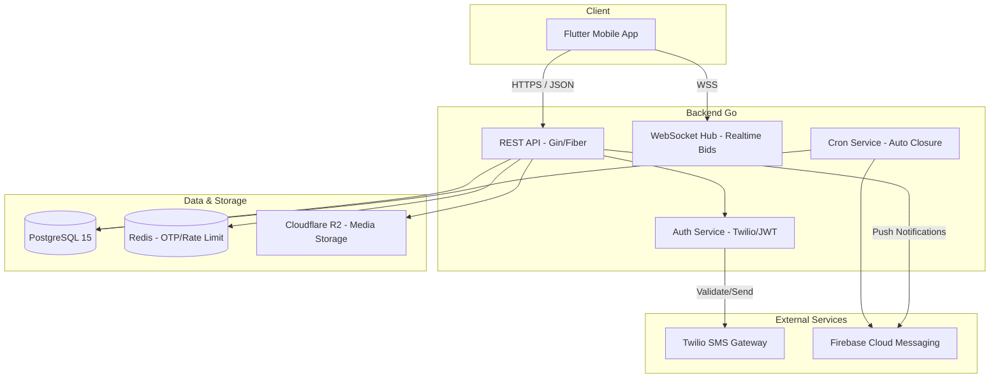
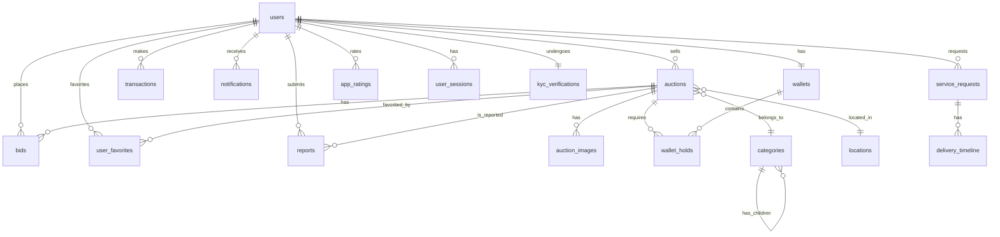
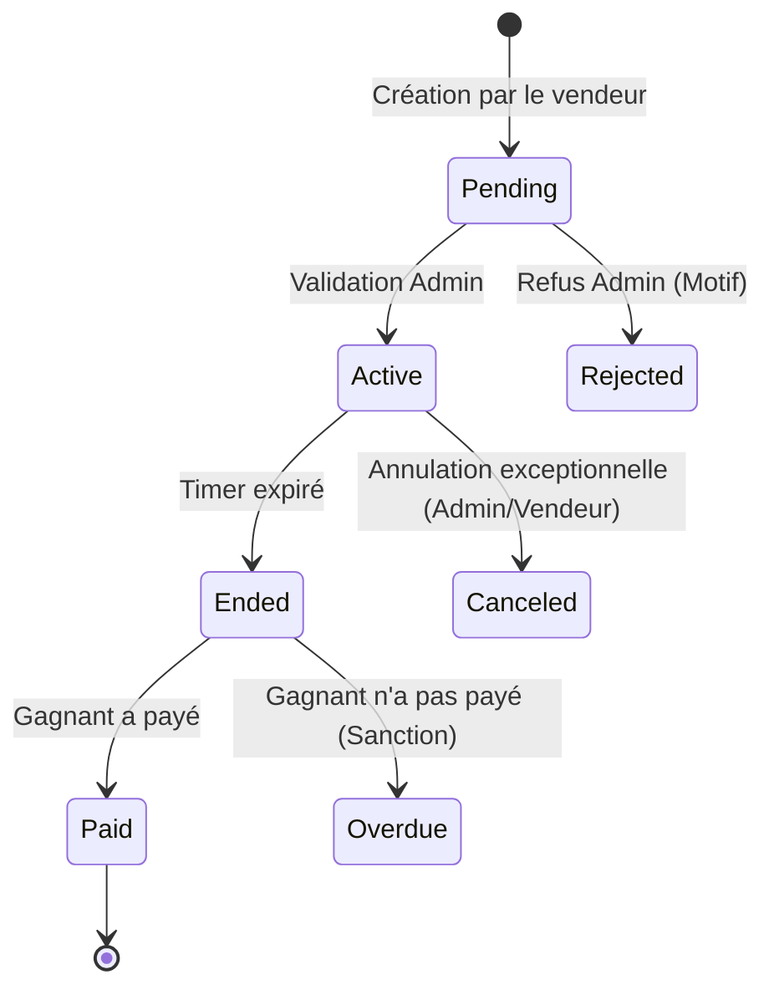
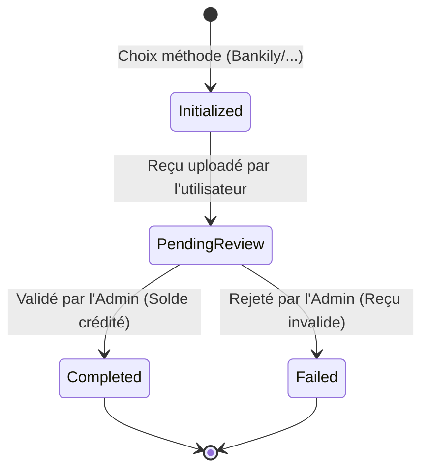

# Rapport d'Analyse Complet — MazadPay Backend (Go)


---

## 1. Architecture Technique Globale

MazadPay repose sur une architecture moderne, orientée services, conçue pour supporter une haute concurrence de mises en temps réel et des transactions financières sécurisées.

### Schéma des Composants



### Stack Technique
- **Frontend** : Flutter (Riverpod pour la gestion d'état).
- **Backend Core** : Go (Golang) pour sa gestion native de la concurrence (Goroutines).
- **Base de Données** : PostgreSQL (Relations, Intégrité, JSONB pour les items).
- **Temps Réel** : WebSockets pour les prix et les compteurs de temps.
- **Cache** : Redis pour le rate-limiting des SMS et le cache des sessions OTP.
- **Stockage** : Compatible S3 (Cloudflare R2) pour les images et vidéos (10Go gratuits, puis 0.015$/GB/mois).

---


## 2. Fonctionnalités Extraites — Inventaire Exhaustif

### 🔐 F1 — Authentification & Onboarding

| ID    | Fonctionnalité                                       | Source                                  | Endpoint Backend                  |
| :---- | :--------------------------------------------------- | :-------------------------------------- | :-------------------------------- |
| F1.1  | Splash Screen animé                                  | `main.dart`                             | — (Frontend only)                 |
| F1.2  | Onboarding (carrousel introductif)                   | `start_bidding_page.dart`               | — (Frontend only)                 |
| F1.3  | Sélection de langue (Arabe / Français / English)     | `language_page.dart`, `app_modals.dart` | `PUT /v1/api/users/me/language`      |
| F1.4  | Acceptation Termes & Conditions                      | `terms_page.dart`                       | `POST /v1/api/users/me/accept-terms` |
| F1.5  | Inscription par numéro de téléphone + PIN 4 chiffres | `login_page.dart`                       | `POST /v1/api/auth/register`         |
| F1.6  | Connexion par téléphone + PIN                        | `login_page.dart`                       | `POST /v1/api/auth/login`            |
| F1.7  | Sélection du pays (code +222 Mauritanie)             | `login_page.dart`                       | Validation côté serveur           |
| F1.8  | Envoi OTP via SMS (Twilio)                           | `otp_entry_page.dart`                   | `POST /v1/api/auth/otp/send`         |
| F1.9  | Vérification OTP (6 chiffres, timer pour renvoi)     | `otp_entry_page.dart`                   | `POST /v1/api/auth/otp/verify`       |
| F1.10 | Mot de passe oublié (reset via OTP)                  | `login_page.dart`                       | `POST /v1/api/auth/reset-password`   |
| F1.11 | Déconnexion                                          | `account_profile_page.dart`             | `POST /v1/api/auth/logout`           |

> [!IMPORTANT]
> **Service SMS/OTP — Twilio** : Le fournisseur retenu pour l'envoi des OTP par SMS est **[Twilio](https://twilio.com)**.
> - **Endpoint Twilio** : `POST {BASE_URL}/v1/api/sms/otp/send`
> - **Paramètres clés** : `api_key`, `to` (format international ex: `2222XXXXXXXX`), `from` (Sender ID enregistré), `channel` (`generic`), `pin_type` (`NUMERIC`), `pin_length` (6), `pin_time_to_live` (5 min), `pin_attempts` (3).
> - **Vérification** : `POST {BASE_URL}/v1/api/sms/otp/verify` avec `pin_id` + `pin` saisi par l'utilisateur.
> - Le `pin_id` retourné par Twilio est stocké temporairement (Redis ou table `otp_verifications`) pour la vérification ultérieure.
> - Rate-limit : **3 tentatives max**, blocage **15 min** après échec.
> - Le canal SMS couvre le réseau mauritanien (+222).

---

### 🏠 F2 — Page d'Accueil & Navigation

| ID    | Fonctionnalité                                           | Source                                                      | Endpoint Backend                       |
| :---- | :------------------------------------------------------- | :---------------------------------------------------------- | :------------------------------------- |
| F2.1  | Bannières promotionnelles (carrousel)                    | `home_page.dart` L67-82                                     | `GET /v1/api/banners`                     |
| F2.2  | Filtre par ville (Nouakchott / Nouadhibou)               | `home_page.dart` L83-104                                    | `GET /v1/api/auctions?city=...`           |
| F2.3  | Liste d'enchères actives avec cards                      | `home_page.dart` L340-420                                   | `GET /v1/api/auctions?status=active`      |
| F2.4  | Indicateur "LIVE" animé                                  | `live_indicator.dart`                                       | Champ `status` dans la réponse auction |
| F2.5  | Barre de recherche                                       | `home_page.dart` L110-130                                   | `GET /v1/api/auctions/search?q=...`       |
| F2.6  | Navigation Bottom Bar (4 tabs + FAB central)             | `home_page.dart`, `services_page.dart`, `account_page.dart` | — (Frontend routing)                   |
| F2.7  | Menu latéral (Side Drawer) avec profil                   | `side_menu_drawer.dart`                                     | `GET /v1/api/users/me`                    |
| F2.8  | Liens réseaux sociaux (Facebook, Insta, TikTok, Snap)    | `side_menu_drawer.dart` L268-275                            | — (liens statiques)                    |
| F2.9  | Partage de l'application                                 | `side_menu_drawer.dart` L233-246                            | — (Deep link)                          |
| F2.10 | Bouton "Évaluer l'app" (noter 1-5 étoiles + commentaire) | `app_modals.dart` L111-217                                  | `POST /v1/api/ratings`                    |
| F2.11 | **Signalement d'annonce (Report)**                       | Nouvel ajout                                                | `POST /v1/api/auctions/{id}/report`       |
| F2.12 | **Demande d'annonce (Banner Request)**                   | Nouvel ajout                                                | `POST /v1/api/banners/request`            |


---

### 🔨 F3 — Système d'Enchères (Core Business)

| ID    | Fonctionnalité                                                          | Source                                               | Endpoint Backend                        |
| :---- | :---------------------------------------------------------------------- | :--------------------------------------------------- | :-------------------------------------- |
| F3.1  | Fiche détaillée d'enchère (galerie images, description)                 | `auction_details_page.dart`                          | `GET /v1/api/auctions/{id}`                |
| F3.2  | Compte à rebours temps réel (H:M:S)                                     | `auction_details_page.dart` L350-400                 | WebSocket `/ws/auction/{id}`            |
| F3.3  | Compteur de vues                                                        | `auction_details_page.dart` L180                     | `POST /v1/api/auctions/{id}/view`          |
| F3.4  | Compteur de participants (bidders)                                      | `auction_details_page.dart` L190                     | Inclus dans `GET /v1/api/auctions/{id}`    |
| F3.5  | Numéro de lot                                                           | `auction_details_page.dart` L200                     | Champ `lot_number`                      |
| F3.6  | Détails techniques (marque, modèle, année, km, carburant, transmission) | `auction_details_page.dart` L420-500, `auction.dart` | Champ JSONB `item_details`              |
| F3.7  | Bouton "Contacter le vendeur" (appel téléphonique)                      | `auction_details_page.dart` L550                     | `GET /v1/api/auctions/{id}/seller-contact` |
| F3.8  | Toggle favori (❤️)                                                      | `auction_details_page.dart` L560                     | `POST /v1/api/favorites/{auction_id}`      |
| F3.9  | Placer une mise (BidActionSheet, 2 étapes : montant → confirmation)     | `bid_action_sheet.dart`                              | `POST /v1/api/auctions/{id}/bids`          |
| F3.10 | Incrémentation/Décrémentation du montant de mise                        | `bid_action_sheet.dart` L88-104                      | Validation côté serveur                 |
| F3.11 | Indicateur "Vous êtes le meilleur enchérisseur"                         | `auction_provider.dart` L47                          | Inclus dans réponse WebSocket           |
| F3.12 | Historique complet des mises (page dédiée)                              | `auction_history_page.dart`                          | `GET /v1/api/auctions/{id}/bids`           |
| F3.13 | Résumé enchère : nb de mises, nb de participants, gagnant               | `auction_history_page.dart` L90-100                  | `GET /v1/api/auctions/{id}/summary`        |
| F3.14 | Numéro de téléphone anonymisé (####4709)                                | `auction_provider.dart` L57-60                       | Masquage côté serveur                   |
| F3.15 | Page "Gagnant de l'enchère" (confettis, félicitations)                  | `auction_winner_page.dart`                           | WebSocket event `auction_won`           |
| F3.16 | Bouton "Compléter le paiement" (post-victoire)                          | `auction_winner_page.dart` L197                      | `POST /v1/api/payments/auction/{id}`       |
| F3.17 | Partager le résultat du gain                                            | `auction_winner_page.dart` L89                       | — (Frontend, Deep Link)                 |


---

### 📝 F4 — Création d'Annonces (Vendeur)

| ID   | Fonctionnalité                                                                             | Source                                                | Endpoint Backend               |
| :--- | :----------------------------------------------------------------------------------------- | :---------------------------------------------------- | :----------------------------- |
| F4.1 | Sélection de catégorie (roue circulaire interactive)                                       | `create_ad_start_page.dart`                           | `GET /v1/api/categories`          |
| F4.2 | 8 catégories principales : عقارات، سيارات، هواتف، الكترونيات، ساعات، دراجات، حيوانات، أثاث | `create_ad_start_page.dart` L13-22                    | Seed SQL                       |
| F4.3 | Formulaire multi-champs (titre, description, prix, téléphone)                              | `create_ad_form_page.dart`                            | `POST /v1/api/auctions`           |
| F4.4 | Sélection de catégorie + sous-catégorie (hiérarchique)                                     | `create_ad_form_page.dart`                            | FK `category_id` + `parent_id` |
| F4.5 | Sélection de la ville et du quartier                                                       | `create_ad_form_page.dart`                            | FK `location_id`               |
| F4.6 | Upload de médias (images + vidéos, max 5)                                                  | `create_ad_form_page.dart`, `media_picker_sheet.dart` | `POST /v1/api/upload` (Cloudflare R2)  |
| F4.7 | Validation des champs obligatoires                                                         | `create_ad_form_page.dart`                            | Validation middleware Go       |

---

### 💰 F5 — Portefeuille & Paiement

| ID    | Fonctionnalité                                                             | Source                               | Endpoint Backend                      |
| :---- | :------------------------------------------------------------------------- | :----------------------------------- | :------------------------------------ |
| F5.1  | Affichage du solde (masquer/afficher "••••••")                             | `account_page.dart` L128-150         | `GET /v1/api/wallets/me`                 |
| F5.2  | **4 passerelles de paiement : Masrivi, Bankily, Sedad, Click**             | `deposit_page.dart` L25-54           | `POST /v1/api/transactions/deposit`      |
| F5.3  | Affichage du code marchand (07755) pour paiement                           | `payment_details_page.dart` L203-206 | Config serveur                        |
| F5.4  | Détails de la transaction (date, statut, frais, montant)                   | `payment_details_page.dart` L249-286 | `GET /v1/api/transactions/{id}`          |
| F5.5  | Upload du reçu de paiement (photo du virement)                             | `payment_details_page.dart` L308-340 | `POST /v1/api/transactions/{id}/receipt` |
| F5.6  | Écran de succès "قيد المراجعة" (en attente de validation admin)            | `payment_success_page.dart`          | Statut `pending_review`               |
| F5.7  | Retrait d'assurance (montant, choix méthode)                               | `withdraw_page.dart`                 | `POST /v1/api/transactions/withdraw`     |
| F5.8  | 2 méthodes de retrait : Virement bancaire + Mobile Money (Bankily/Masrivi) | `withdraw_page.dart` L70-72          | Champ `gateway`                       |
| F5.9  | Dialogue de confirmation retrait ("Traitement sous 24h")                   | `withdraw_page.dart` L145-181        | Réponse API                           |
| F5.10 | Termes et conditions de paiement/assurance (5 clauses)                     | `deposit_page.dart` L130-134         | `GET /v1/api/terms/payment`              |

> [!IMPORTANT]
> **Processus de paiement actuel** : Le flux est MANUEL — l'utilisateur paie via l'app bancaire externe, puis **uploade la photo du reçu**. Un admin doit ensuite **valider manuellement** le paiement. Cela nécessite un **panneau d'administration** côté backend.

---

### 👤 F6 — Gestion du Compte Utilisateur

| ID   | Fonctionnalité                                            | Source                               | Endpoint Backend                |
| :--- | :-------------------------------------------------------- | :----------------------------------- | :------------------------------ |
| F6.1 | Page profil avec avatar, nom, téléphone                   | `account_profile_page.dart`          | `GET /v1/api/users/me`             |
| F6.2 | Modification du nom, email, ville                         | `account_profile_page.dart` L110-113 | `PUT /v1/api/users/me`             |
| F6.3 | Changement de photo de profil (icône caméra)              | `account_profile_page.dart` L82-91   | `POST /v1/api/users/me/avatar`     |
| F6.4 | Changement de mot de passe (PIN)                          | `account_profile_page.dart` L119     | `PUT /v1/api/auth/change-password` |
| F6.5 | Basculer notifications ON/OFF                             | `account_profile_page.dart` L121     | `PUT /v1/api/users/me/settings`    |
| F6.6 | Mes Enchères (liste avec statut "fائزة" / "سعر أعلى منك") | `my_auctions_page.dart`              | `GET /v1/api/users/me/bids`        |
| F6.7 | Mes Favoris (grille avec bouton "Enchérir maintenant")    | `favorites_page.dart`                | `GET /v1/api/users/me/favorites`   |
| F6.8 | Mes Gains (liste avec statut "مدفوع" / "في انتظار الدفع") | `my_winnings_page.dart`              | `GET /v1/api/users/me/winnings`    |

---

### 🚚 F7 — Services Complémentaires (Livraison & Transport)

| ID   | Fonctionnalité                                                                             | Source                                | Endpoint Backend                    |
| :--- | :----------------------------------------------------------------------------------------- | :------------------------------------ | :---------------------------------- |
| F7.1 | 5 types de services : Livraison, Course, Course inter-villes, Transport marchandise, Autre | `services_page.dart` L119-136         | `GET /v1/api/services`                 |
| F7.2 | Page détails de livraison avec tracking (numéro MP-XXXXX)                                  | `delivery_details_page.dart` L75-76   | `GET /v1/api/deliveries/{id}`          |
| F7.3 | Timeline de statut (4 étapes visuelles)                                                    | `delivery_details_page.dart` L98-106  | `GET /v1/api/deliveries/{id}/timeline` |
| F7.4 | Adresse de livraison (affichage)                                                           | `delivery_details_page.dart` L177     | FK `location_id`                    |
| F7.5 | Infos livreur (nom, photo, boutons appel + chat)                                           | `delivery_details_page.dart` L205-216 | `GET /v1/api/deliveries/{id}/driver`   |
| F7.6 | Module e-commerce (placeholder "غير متاح حاليًا")                                          | `services_page.dart` L55-61           | **À concevoir (Sprint futur)**      |
|      |                                                                                            |                                       |                                     |

---

### 🔔 F8 — Notifications & Communication

| ID   | Fonctionnalité                                                               | Source                           | Endpoint Backend                  |
| :--- | :--------------------------------------------------------------------------- | :------------------------------- | :-------------------------------- |
| F8.1 | 5 types de notifications : bid, win, payment, system, ad                     | `notifications_page.dart` L54-93 | `GET /v1/api/notifications`          |
| F8.2 | Bouton "Tout marquer comme lu"                                               | `notifications_page.dart` L33,   | `PUT /v1/api/notifications/read-all` |
| F8.3 | Contact WhatsApp (47601175)                                                  | `app_modals.dart` L262           | — (lien externe)                  |
| F8.4 | Contact Email (mazadpay@gmail.com)                                           | `app_modals.dart` L277           | — (lien mailto)                   |
| F8.5 | Centre de support (WhatsApp + Téléphone + Email)                             | `support_page.dart`              | `GET /v1/api/support/contacts`       |
| F8.6 | FAQ (3 questions: comment enchérir, récupérer assurance, moyens de paiement) | `support_page.dart` L76-78       | `GET /v1/api/faq`                    |

---

### 📚 F9 — Contenu Statique & Éducation

| ID   | Fonctionnalité                                                                 | Source                          | Endpoint Backend          |
| :--- | :----------------------------------------------------------------------------- | :------------------------------ | :------------------------ |
| F9.1 | Vidéos tutorielles (5 sujets: paiement, enchères, réception, commissions, FAQ) | `how_to_bid_page.dart` L17-43   | `GET /v1/api/tutorials`      |
| F9.2 | Lecteur vidéo intégré (play/pause, seek +10/-10s)                              | `how_to_bid_page.dart` L170-313 | Streaming vidéo           |
| F9.3 | Page "À propos de MazadPay"                                                    | `about_mazad_pay_page.dart`     | `GET /v1/api/about`          |
| F9.4 | Politique de confidentialité (5 sections)                                      | `privacy_policy_page.dart`      | `GET /v1/api/privacy-policy` |
| F9.5 | Version de l'app affichée (v3.2.0)                                             | `side_menu_drawer.dart` L279    | `GET /v1/api/config/version` |

---

## 3. Schéma SQL Complet & Optimisé (PostgreSQL)

```
-- ============================================================
-- MAZADPAY — SCHÉMA COMPLET DE BASE DE DONNÉES
-- PostgreSQL  | Encodage UTF-8 | Timezone-aware
-- ============================================================

CREATE EXTENSION IF NOT EXISTS "uuid-ossp";

-- ============================================================
-- 1. AUTHENTIFICATION & UTILISATEURS
-- ============================================================

CREATE TABLE users (
    id UUID PRIMARY KEY DEFAULT uuid_generate_v4(),
    phone VARCHAR(20) UNIQUE NOT NULL,
    password_hash TEXT NOT NULL,              -- PIN 4 chiffres hashé (Bcrypt)
    full_name VARCHAR(100),
    email VARCHAR(150),
    profile_pic_url TEXT,
    city VARCHAR(50),
    language_pref VARCHAR(5) DEFAULT 'ar',    -- 'ar', 'fr', 'en'
    notifications_enabled BOOLEAN DEFAULT TRUE,
    terms_accepted_at TIMESTAMP WITH TIME ZONE,
    is_active BOOLEAN DEFAULT TRUE,
    role VARCHAR(20) NOT NULL DEFAULT 'user', -- 'user', 'admin', 'driver'
    is_verified BOOLEAN DEFAULT FALSE,        -- TRUE après première vérification OTP réussie
    blocked_until TIMESTAMP WITH TIME ZONE,   -- Blocage temporaire après X tentatives PIN
    last_login_at TIMESTAMP WITH TIME ZONE,
    created_at TIMESTAMP WITH TIME ZONE DEFAULT CURRENT_TIMESTAMP,
    updated_at TIMESTAMP WITH TIME ZONE DEFAULT CURRENT_TIMESTAMP,

    CONSTRAINT chk_user_role CHECK (role IN ('user', 'admin', 'driver'))
);


CREATE TABLE otp_verifications (
    id UUID PRIMARY KEY DEFAULT uuid_generate_v4(),
    phone VARCHAR(20) NOT NULL,               -- Numéro au format international (+222XXXXXXXX)
    twilio_sid VARCHAR(100) NOT NULL,      -- SID retourné par l'API Twilio (pour vérification)
    purpose VARCHAR(20) NOT NULL DEFAULT 'register', -- 'register', 'reset_password'
    attempts INT DEFAULT 0,                   -- Nombre de tentatives de vérification
    max_attempts INT DEFAULT 3,               -- Limite de 3 tentatives
    expires_at TIMESTAMP WITH TIME ZONE NOT NULL, -- TTL 5 minutes
    verified_at TIMESTAMP WITH TIME ZONE,     -- NULL si no n encore vérifié
    ip_address VARCHAR(45),                   -- IP de la requête (sécurité / traçabilité)
    created_at TIMESTAMP WITH TIME ZONE DEFAULT CURRENT_TIMESTAMP,

    CONSTRAINT chk_otp_attempts CHECK (attempts <= max_attempts),
    CONSTRAINT chk_otp_purpose CHECK (purpose IN ('register', 'reset_password'))
);

CREATE INDEX idx_otp_phone ON otp_verifications(phone);
CREATE INDEX idx_otp_expires ON otp_verifications(expires_at);


-- ============================================================
-- 2. TAXONOMIE & LOCALISATION
-- ============================================================

CREATE TABLE categories (
    id SERIAL PRIMARY KEY,
    name_ar VARCHAR(100) NOT NULL,
    name_fr VARCHAR(100) NOT NULL,
    name_en VARCHAR(100) NOT NULL DEFAULT '',
    parent_id INT REFERENCES categories(id) ON DELETE CASCADE,
    icon_name VARCHAR(50),
    display_order INT DEFAULT 0
);

CREATE TABLE countries (
    id SERIAL PRIMARY KEY,
    code VARCHAR(2) UNIQUE NOT NULL,
    name_ar VARCHAR(100) NOT NULL,
    name_fr VARCHAR(100) NOT NULL,
    name_en VARCHAR(100),
    flag_emoji VARCHAR(10),
    is_active BOOLEAN DEFAULT TRUE,
    created_at TIMESTAMP WITH TIME ZONE DEFAULT CURRENT_TIMESTAMP,
    updated_at TIMESTAMP WITH TIME ZONE DEFAULT CURRENT_TIMESTAMP
);

CREATE TABLE locations (
    id SERIAL PRIMARY KEY,
    city_name_ar VARCHAR(100) NOT NULL,
    city_name_fr VARCHAR(100) NOT NULL DEFAULT '',
    area_name_ar VARCHAR(100) NOT NULL,
    area_name_fr VARCHAR(100) NOT NULL DEFAULT '',
    country_id INT REFERENCES countries(id) ON DELETE SET NULL
);

-- ============================================================
-- 3. SYSTÈME D'ENCHÈRES
-- ============================================================

CREATE TABLE auctions (
    id UUID PRIMARY KEY DEFAULT uuid_generate_v4(),
    seller_id UUID REFERENCES users(id) NOT NULL,
    category_id INT REFERENCES categories(id) NOT NULL,
    location_id INT REFERENCES locations(id),
    title_ar VARCHAR(200) NOT NULL,
    title_fr VARCHAR(200),
    title_en VARCHAR(200),
    description_ar TEXT,
    description_fr TEXT,
    description_en TEXT,
    start_price DECIMAL(15, 2) NOT NULL DEFAULT 0.00,
    current_price DECIMAL(15, 2) NOT NULL DEFAULT 0.00,
    min_increment DECIMAL(15, 2) NOT NULL DEFAULT 100.00,
    insurance_amount DECIMAL(15, 2) DEFAULT 0.00,
    reserve_price DECIMAL(15, 2) DEFAULT 0.00,
    start_time TIMESTAMP WITH TIME ZONE DEFAULT CURRENT_TIMESTAMP,
    end_time TIMESTAMP WITH TIME ZONE NOT NULL,
    status VARCHAR(20) DEFAULT 'pending',
    lot_number VARCHAR(50) UNIQUE,
    views INT DEFAULT 0,
    bidder_count INT DEFAULT 0,
    winner_id UUID REFERENCES users(id),
    winning_bid_id UUID,
    payment_deadline TIMESTAMP WITH TIME ZONE,
    is_featured BOOLEAN DEFAULT FALSE,
    featured_until TIMESTAMP WITH TIME ZONE,
    rejection_reason TEXT,
    phone_contact VARCHAR(20),
    item_details JSONB,
    buy_now_price DECIMAL(15, 2),
    version INT DEFAULT 1,
    created_at TIMESTAMP WITH TIME ZONE DEFAULT CURRENT_TIMESTAMP,

    CONSTRAINT chk_auction_prices CHECK (current_price >= start_price),
    CONSTRAINT chk_auction_status CHECK (status IN ('pending', 'active', 'ended', 'canceled', 'rejected'))
);

CREATE TABLE bids ( 
    id UUID PRIMARY KEY DEFAULT uuid_generate_v4(),
    auction_id UUID REFERENCES auctions(id) ON DELETE CASCADE,
    user_id UUID REFERENCES users(id),
    amount DECIMAL(15, 2) NOT NULL,
    previous_price DECIMAL(15, 2),            -- Prix avant cette mise (historique)
    is_winning BOOLEAN DEFAULT FALSE,
    created_at TIMESTAMP WITH TIME ZONE DEFAULT CURRENT_TIMESTAMP,

    CONSTRAINT chk_bid_amount CHECK (amount > 0)
);

-- FK différée : winning_bid_id sur auctions (après création de bids)
ALTER TABLE auctions ADD CONSTRAINT fk_auction_winning_bid
    FOREIGN KEY (winning_bid_id) REFERENCES bids(id) DEFERRABLE INITIALLY DEFERRED;

CREATE INDEX idx_bids_auction   ON bids(auction_id);
CREATE INDEX idx_bids_user      ON bids(user_id);
CREATE INDEX idx_bids_top       ON bids(auction_id, amount DESC);


CREATE TABLE auction_images (
    id SERIAL PRIMARY KEY,
    auction_id UUID REFERENCES auctions(id) ON DELETE CASCADE,
    url TEXT NOT NULL,
    media_type VARCHAR(10) DEFAULT 'image',   -- 'image', 'video'
    display_order INT DEFAULT 0
);


CREATE TABLE user_favorites (
    user_id UUID REFERENCES users(id) ON DELETE CASCADE,
    auction_id UUID REFERENCES auctions(id) ON DELETE CASCADE,
    created_at TIMESTAMP WITH TIME ZONE DEFAULT CURRENT_TIMESTAMP,
    PRIMARY KEY (user_id, auction_id)
);


-- ============================================================
-- 4. FINANCES & PORTEFEUILLE
-- ============================================================

CREATE TABLE wallets (
    user_id UUID PRIMARY KEY REFERENCES users(id),
    balance DECIMAL(15, 2) DEFAULT 0.00,
    frozen_amount DECIMAL(15, 2) DEFAULT 0.00,
    version INT DEFAULT 1,                    -- Verrouillage optimiste
    updated_at TIMESTAMP WITH TIME ZONE DEFAULT CURRENT_TIMESTAMP,

    CONSTRAINT chk_wallet_balance CHECK (balance >= 0),
    CONSTRAINT chk_wallet_frozen CHECK (frozen_amount >= 0)
);

CREATE TABLE transactions (
    id UUID PRIMARY KEY DEFAULT uuid_generate_v4(),
    user_id UUID REFERENCES users(id),
    auction_id UUID REFERENCES auctions(id),   -- Lier à une enchère (caution/paiement)
    type VARCHAR(20) NOT NULL,                -- deposit, withdraw, bid_hold, bid_refund, payment
    amount DECIMAL(15, 2) NOT NULL,
    gateway VARCHAR(50),                      -- Bankily, Masrivi, Sedad, Click, Bank Transfer
    status VARCHAR(20) DEFAULT 'pending',     -- pending, pending_review, completed, failed, refunded
    reference VARCHAR(100),                   -- ID de transaction externe
    receipt_url TEXT,                          -- URL de l'image du reçu uploadé
    admin_notes TEXT,                          -- Notes de l'admin lors de la validation
    reviewed_by UUID REFERENCES users(id),     -- Admin qui a validé
    reviewed_at TIMESTAMP WITH TIME ZONE,
    created_at TIMESTAMP WITH TIME ZONE DEFAULT CURRENT_TIMESTAMP
);

CREATE TABLE wallet_holds (
    id UUID PRIMARY KEY DEFAULT uuid_generate_v4(),
    user_id UUID REFERENCES users(id),
    auction_id UUID REFERENCES auctions(id),
    amount DECIMAL(15, 2) NOT NULL,
    status VARCHAR(20) DEFAULT 'active',      -- active, released, captured
    transaction_id UUID REFERENCES transactions(id), -- Transaction de capture (paiement final)
    released_at TIMESTAMP WITH TIME ZONE,     -- Horodatage de libération (défaite ou remboursement)
    created_at TIMESTAMP WITH TIME ZONE DEFAULT CURRENT_TIMESTAMP,

    CONSTRAINT chk_hold_status CHECK (status IN ('active', 'released', 'captured')),
    CONSTRAINT chk_hold_amount CHECK (amount > 0)
);

CREATE INDEX idx_holds_auction ON wallet_holds(auction_id, status);
CREATE INDEX idx_holds_user    ON wallet_holds(user_id);

-- Lien bidirectionnel : transactions vers wallet_holds
ALTER TABLE transactions ADD COLUMN wallet_hold_id UUID REFERENCES wallet_holds(id);


-- ============================================================
-- 5. NOTIFICATIONS
-- ============================================================

CREATE TABLE notifications (
    id UUID PRIMARY KEY DEFAULT uuid_generate_v4(),
    user_id UUID REFERENCES users(id) ON DELETE CASCADE,
    type VARCHAR(20) NOT NULL,                -- bid, win, payment, system, ad
    title VARCHAR(200) NOT NULL,
    body TEXT,
    is_read BOOLEAN DEFAULT FALSE,
    reference_id UUID,                        -- ID de la ressource liée (auction, transaction...)
    reference_type VARCHAR(50),               -- 'auction', 'transaction', 'delivery'
    data JSONB,                               -- Payload supplémentaire
    created_at TIMESTAMP WITH TIME ZONE DEFAULT CURRENT_TIMESTAMP,

    CONSTRAINT chk_notif_type CHECK (type IN ('bid', 'win', 'payment', 'system', 'ad'))
);

-- ============================================================
-- 6. SERVICES COMPLÉMENTAIRES (Livraison/Transport)
-- ============================================================

CREATE TABLE service_requests (
    id UUID PRIMARY KEY DEFAULT uuid_generate_v4(),
    user_id UUID REFERENCES users(id),
    service_type VARCHAR(50) NOT NULL,        -- delivery, taxi, intercity, shipping, other
    pickup_location TEXT,
    delivery_location TEXT,
    status VARCHAR(20) DEFAULT 'pending',     -- pending, assigned, in_transit, delivered, canceled
    tracking_number VARCHAR(20),              -- MP-XXXXX-YYYY
    estimated_price DECIMAL(15, 2),
    actual_price DECIMAL(15, 2),              -- Prix final facturé (peut différer de l'estimation)
    notes TEXT,                               -- Instructions spéciales du client
    driver_id UUID REFERENCES users(id),      -- Doit avoir users.role = 'driver'
    completed_at TIMESTAMP WITH TIME ZONE,    -- Horodatage de fin de livraison
    created_at TIMESTAMP WITH TIME ZONE DEFAULT CURRENT_TIMESTAMP
);

CREATE TABLE delivery_timeline (
    id SERIAL PRIMARY KEY,
    request_id UUID REFERENCES service_requests(id) ON DELETE CASCADE,
    step_name VARCHAR(100) NOT NULL,          -- received, processing, shipped, delivering
    description TEXT,
    completed_at TIMESTAMP WITH TIME ZONE,
    created_at TIMESTAMP WITH TIME ZONE DEFAULT CURRENT_TIMESTAMP
);

-- ============================================================
-- 7. CONTENU 
-- ============================================================


CREATE TABLE faq_items (
    id SERIAL PRIMARY KEY,
    question_ar TEXT NOT NULL,
    question_fr TEXT,
    answer_ar TEXT NOT NULL,
    answer_fr TEXT,
    display_order INT DEFAULT 0
);

CREATE TABLE banners (
    id SERIAL PRIMARY KEY,
    title_ar VARCHAR(200),                    -- Titre d'accroche en arabe
    title_fr VARCHAR(200),                    -- Titre d'accroche en français
    image_url TEXT NOT NULL,
    target_url TEXT,                          -- Lien optionnel au clic
    is_active BOOLEAN DEFAULT TRUE,
    starts_at TIMESTAMP WITH TIME ZONE,       -- Planification début campagne (Cron)
    ends_at TIMESTAMP WITH TIME ZONE,         -- Planification fin campagne (Cron)
    display_order INT DEFAULT 0
);

CREATE TABLE app_ratings (
    id UUID PRIMARY KEY DEFAULT uuid_generate_v4(),
    user_id UUID REFERENCES users(id),
    rating INT CHECK (rating BETWEEN 1 AND 5),
    comment TEXT,
    created_at TIMESTAMP WITH TIME ZONE DEFAULT CURRENT_TIMESTAMP,

    CONSTRAINT uq_rating_user UNIQUE (user_id) -- Un seul avis par utilisateur
);

CREATE TABLE tutorials (
    id SERIAL PRIMARY KEY,
    title_ar VARCHAR(200) NOT NULL,
    title_fr VARCHAR(200),
    video_url TEXT NOT NULL,
    thumbnail_url TEXT,
    category VARCHAR(50), 
    display_order INT DEFAULT 0
);

CREATE TABLE reports (
    id UUID PRIMARY KEY DEFAULT uuid_generate_v4(),
    auction_id UUID REFERENCES auctions(id) ON DELETE CASCADE,
    reporter_id UUID REFERENCES users(id),
    reason TEXT NOT NULL,
    status VARCHAR(20) DEFAULT 'pending',     -- pending, reviewed, dismissed
    reviewed_by UUID REFERENCES users(id),    -- Admin qui a traité le signalement
    reviewed_at TIMESTAMP WITH TIME ZONE,
    admin_notes TEXT,                         -- Résultat de la modération
    created_at TIMESTAMP WITH TIME ZONE DEFAULT CURRENT_TIMESTAMP
);

CREATE TABLE kyc_verifications (
    user_id UUID PRIMARY KEY REFERENCES users(id),
    id_card_front_url TEXT,
    id_card_back_url TEXT,
    nni_number VARCHAR(50),
    status VARCHAR(20) DEFAULT 'pending',     -- pending, approved, rejected
    admin_notes TEXT,
    reviewed_by UUID REFERENCES users(id),    -- Admin qui a validé/rejeté le KYC
    reviewed_at TIMESTAMP WITH TIME ZONE,     -- Horodatage obligatoire (conformité légale)
    expires_at TIMESTAMP WITH TIME ZONE,      -- Date d'expiration de la pièce d'identité
    created_at TIMESTAMP WITH TIME ZONE DEFAULT CURRENT_TIMESTAMP
);

-- ============================================================
-- 8b. NOUVELLES TABLES
-- ============================================================

-- Push Tokens Firebase FCM (obligatoire pour Notification Service)
CREATE TABLE push_tokens (
    id UUID PRIMARY KEY DEFAULT uuid_generate_v4(),
    user_id UUID REFERENCES users(id) ON DELETE CASCADE,
    fcm_token TEXT NOT NULL,
    device_id TEXT,
    platform VARCHAR(10) CHECK (platform IN ('android', 'ios', 'web')),
    is_active BOOLEAN DEFAULT TRUE,
    created_at TIMESTAMP WITH TIME ZONE DEFAULT CURRENT_TIMESTAMP,
    updated_at TIMESTAMP WITH TIME ZONE DEFAULT CURRENT_TIMESTAMP,
    CONSTRAINT uq_fcm_token UNIQUE (fcm_token)
);
CREATE INDEX idx_push_tokens_user ON push_tokens(user_id);

-- Invitations d'Admin
CREATE TABLE admin_invitations (
    id UUID PRIMARY KEY DEFAULT gen_random_uuid(),
    token VARCHAR(255) UNIQUE NOT NULL,
    created_by UUID REFERENCES users(id) ON DELETE CASCADE,
    expires_at TIMESTAMP NOT NULL,
    used_at TIMESTAMP,
    created_at TIMESTAMP DEFAULT CURRENT_TIMESTAMP
);
CREATE INDEX idx_admin_invitations_token ON admin_invitations(token);

-- Paiements post-victoire d'enchère (F3.16 — POST /v1/api/payments/auction/{id})
CREATE TABLE auction_payments (
    id UUID PRIMARY KEY DEFAULT uuid_generate_v4(),
    auction_id UUID REFERENCES auctions(id) NOT NULL,
    winner_id UUID REFERENCES users(id) NOT NULL,
    transaction_id UUID REFERENCES transactions(id), -- Lié à la transaction de paiement final
    amount DECIMAL(15, 2) NOT NULL,
    status VARCHAR(20) DEFAULT 'pending',     -- pending, completed, failed, overdue
    deadline TIMESTAMP WITH TIME ZONE NOT NULL, -- Date limite de paiement
    paid_at TIMESTAMP WITH TIME ZONE,
    created_at TIMESTAMP WITH TIME ZONE DEFAULT CURRENT_TIMESTAMP,

    CONSTRAINT uq_auction_payment UNIQUE (auction_id),
    CONSTRAINT chk_payment_status CHECK (status IN ('pending', 'completed', 'failed', 'overdue'))
);
CREATE INDEX idx_auction_payments_winner   ON auction_payments(winner_id);
CREATE INDEX idx_auction_payments_deadline ON auction_payments(deadline) WHERE status = 'pending';

-- Blacklist numéros abusifs (Modération / Anti-fraude)
CREATE TABLE blocked_phones (
    phone VARCHAR(20) PRIMARY KEY,
    reason TEXT,
    blocked_by UUID REFERENCES users(id),
    expires_at TIMESTAMP WITH TIME ZONE,      -- NULL = blocage permanent
    blocked_at TIMESTAMP WITH TIME ZONE DEFAULT CURRENT_TIMESTAMP
);

-- ============================================================
-- 9. AUDIT & LOGGING (Nouveaux)
-- ============================================================

-- Audit logs pour tracer les actions admin
CREATE TABLE audit_logs (
    id UUID PRIMARY KEY DEFAULT gen_random_uuid(),
    admin_id UUID REFERENCES users(id) ON DELETE CASCADE,
    action VARCHAR(100) NOT NULL,
    entity_type VARCHAR(50) NOT NULL,
    entity_id UUID,
    details TEXT,
    created_at TIMESTAMP WITH TIME ZONE DEFAULT now()
);
CREATE INDEX idx_audit_logs_entity ON audit_logs(entity_type, entity_id);
CREATE INDEX idx_audit_logs_admin ON audit_logs(admin_id);
CREATE INDEX idx_audit_logs_created ON audit_logs(created_at DESC);

-- System settings (configuration globale)
CREATE TABLE system_settings (
    id SERIAL PRIMARY KEY,
    key VARCHAR(100) UNIQUE NOT NULL,
    value TEXT NOT NULL,
    type VARCHAR(20) DEFAULT 'string',
    updated_by UUID REFERENCES users(id),
    updated_at TIMESTAMP WITH TIME ZONE DEFAULT now()
);

-- Insert default settings
INSERT INTO system_settings (key, value, type) VALUES
    ('maintenance_mode', 'false', 'boolean'),
    ('registration_open', 'true', 'boolean'),
    ('max_auction_duration_hours', '72', 'number'),
    ('default_insurance_amount', '1000', 'number'),
    ('min_bid_increment', '100', 'number'),
    ('contact_whatsapp', '47601175', 'string'),
    ('contact_email', 'mazadpay@gmail.com', 'string')
ON CONFLICT (key) DO NOTHING;

-- ============================================================
-- 10. INDEX DE PERFORMANCE
-- ============================================================

-- Index existants
CREATE INDEX idx_auctions_status   ON auctions(status);
CREATE INDEX idx_auctions_seller   ON auctions(seller_id);
CREATE INDEX idx_auctions_category ON auctions(category_id);
CREATE INDEX idx_auctions_end_time ON auctions(end_time);
CREATE INDEX idx_transactions_user ON transactions(user_id);
CREATE INDEX idx_transactions_status ON transactions(status);
CREATE INDEX idx_notifications_user ON notifications(user_id, is_read);
CREATE INDEX idx_favorites_user    ON user_favorites(user_id);

-- Nouveaux index critiques (hot paths)
CREATE INDEX idx_auctions_winner   ON auctions(winner_id);
CREATE INDEX idx_auctions_featured ON auctions(is_featured) WHERE is_featured = TRUE;
CREATE INDEX idx_notif_reference   ON notifications(reference_id) WHERE reference_id IS NOT NULL;
CREATE INDEX idx_banners_active    ON banners(is_active, starts_at, ends_at);
 

-- ============================================================
-- 10. SYSTÈME DE NOTIFICATIONS (Détails)
-- ============================================================

-- Le système de notifications repose sur Firebase Cloud Messaging (FCM) pour le temps réel
-- et une table `notifications` pour l'historique consultable dans l'application.

-- Les jetons FCM sont stockés dans `push_tokens` lors de l'ouverture de l'application.
-- Un service en arrière-plan (Cron) nettoie automatiquement les notifications de plus de 30 jours.

-- Types de notifications gérés :
-- 1. `bid` : Nouvelle mise sur votre enchère ou surenchère reçue.
-- 2. `win` : Vous avez gagné une enchère.
-- 3. `payment` : Confirmation ou refus d'un dépôt/retrait.
-- 4. `report` : Signalement d'une enchère (Admin).
-- 5. `banner_request` : Nouvelle demande d'annonce (Admin).
-- 6. `system` : Messages généraux ou maintenance.

-- ============================================================
-- 11. TRIGGERS AUTOMATIQUES
-- ============================================================

CREATE OR REPLACE FUNCTION update_modified_column()
RETURNS TRIGGER AS $$
BEGIN
    NEW.updated_at = now();
    RETURN NEW;
END;
$$ LANGUAGE 'plpgsql';

CREATE TRIGGER trg_users_updated BEFORE UPDATE ON users
    FOR EACH ROW EXECUTE PROCEDURE update_modified_column();

CREATE TRIGGER trg_wallets_updated BEFORE UPDATE ON wallets
    FOR EACH ROW EXECUTE PROCEDURE update_modified_column();


```

---

## 4. Diagramme Relationnel (ERD)



---

## 5. Dictionnaire de Données (Détails des Champs)

Cette section présente le détail de chaque table pour garantir une implémentation sans ambiguïté côté Backend et Frontend.

### 5.1. Domaine : Utilisateurs & Sécurité

#### Table: `users`
| Champ | Type | Description |
| :--- | :--- | :--- |
| `id` | UUID | Identifiant unique (PK). |
| `phone` | VARCHAR(20) | Numéro de téléphone (Format +222XXXXXXXX, Unique). |
| `password_hash` | TEXT | PIN 4 chiffres hashé via Bcrypt. |
| `full_name` | VARCHAR(100) | Nom complet de l'utilisateur. |
| `role` | VARCHAR(20) | `user`, `admin`, `driver`. |
| `is_verified` | BOOLEAN | TRUE si l'OTP a été validé au moins une fois. |
| `language_pref` | VARCHAR(5) | `ar`, `fr`, `en`. Default: `ar`. |
| `version` | INT | Utilisé pour le verrouillage optimiste. |

#### Table: `otp_verifications`
| Champ | Type | Description |
| :--- | :--- | :--- |
| `phone` | VARCHAR(20) | Numéro cible. |
| `twilio_sid` | VARCHAR(100) | SID renvoyé par Twilio pour vérification ultérieure. |
| `expires_at` | TIMESTAMP | Expiration (5 min). |
| `verified_at` | TIMESTAMP | Date de réussite (NULL par défaut). |

---

### 5.2. Domaine : Enchères (Core)

#### Table: `auctions`
| Champ | Type | Description |
| :--- | :--- | :--- |
| `id` | UUID | Identifiant unique. |
| `seller_id` | UUID | FK vers `users.id`. |
| `title_ar/fr/en` | VARCHAR(200) | Titre de l'annonce multilingue. |
| `description_ar/fr/en` | TEXT | Description multilingue. |
| `item_details` | JSONB | Données techniques (ex: {marque: "Toyota", année: "2022"}). |
| `buy_now_price` | DECIMAL | Option Achat Immédiat. |
| `start_time` | TIMESTAMP | Date et heure de début de l'enchère. |
| `start_price` | DECIMAL | Prix d'ouverture. |
| `current_price` | DECIMAL | Prix actuel (mis à jour à chaque bid valide). |
| `insurance_amount` | DECIMAL | Caution requise pour miser (affichée en MRU). |
| `status` | VARCHAR | `pending`, `active`, `ended`, `canceled`. |
| `lot_number` | VARCHAR | Numéro de lot unique, auto-incrémenté (ex: LOT-01). |
| `end_time` | TIMESTAMP | Date et heure de clôture calculée. |

#### Table: `bids`
| Champ | Type | Description |
| :--- | :--- | :--- |
| `id` | UUID | Identifiant unique. |
| `auction_id` | UUID | L'enchère concernée. |
| `user_id` | UUID | L'enchérisseur. |
| `amount` | DECIMAL | Montant de la mise. |
| `created_at` | TIMESTAMP | Date précise (utilisée pour le tie-breaking si nécessaire). |

---

### 5.3. Domaine : Finances

#### Table: `wallets`
| Champ | Type | Description |
| :--- | :--- | :--- |
| `user_id` | UUID | PK + FK vers `users`. |
| `balance` | DECIMAL | Solde réel disponible. |
| `frozen_amount` | DECIMAL | Montant actuellement gelé pour des cautions d'enchères en cours. |

#### Table: `transactions`
| Champ | Type | Description |
| :--- | :--- | :--- |
| `id` | UUID | Identifiant unique. |
| `user_id` | UUID | L'auteur de la transaction. |
| `auction_id` | UUID | L'enchère liée (si caution ou achat). |
| `type` | VARCHAR | `deposit`, `withdraw`, `bid_hold`, `payment`. |
| `status` | VARCHAR | `pending`, `pending_review`, `completed`, `failed`. |
| `amount` | DECIMAL | Montant de l'opération. |
| `gateway` | VARCHAR | Bankily, Masrivi, Sedad, Click. |
| `receipt_url` | TEXT | URL de l'image du reçu bancaire. |
| `admin_notes` | TEXT | Raison du refus ou notes internes. |

---

### 5.4. Domaine : Taxonomie & Localisation

#### Tables (23)

| # | Table | Description | Clés |
|:--|:---|:---|:---|
| 1 | `users` | Profils utilisateurs (rôles, vérification) | PK: `id` (UUID) |
| 2 | `otp_verifications` | Codes OTP et traçabilité IP | FK: `phone` |
| 3 | `categories` | Catégories hiérarchiques | FK: `parent_id` |
| 4 | `countries` | Pays (code, noms multilingues, drapeau) | PK: `id` (SERIAL) |
| 5 | `locations` | Villes et quartiers (avec FK vers pays) | FK: `country_id` |
| 6 | `auctions` | Enchères (featured, winner link) | FK: `seller_id`, `category_id`, `location_id` |
| 6 | `auctions` | Enchères (featured, winner link) | FK: `seller_id`, `category_id`, `location_id` |

#### Table: `locations`
| Champ | Type | Description |
| :--- | :--- | :--- |
| `id` | SERIAL | Identifiant unique. |
| `city_name_ar/fr` | VARCHAR | Nom de la ville (Mauritanie). |
| `area_name_ar/fr` | VARCHAR | Zone, quartier ou moughataa. |

---

### 5.5. Domaine : CMS & Contenu

#### Table: `banners`
| Champ | Type | Description |
| :--- | :--- | :--- |
| `image_url` | TEXT | Image haute résolution. |
| `title_ar/fr` | VARCHAR | Titre accrocheur. |
| `target_url` | TEXT | Lien interne (ex: auction id) ou externe. |
| `is_active` | BOOLEAN | Visibilité sur la Home. |

#### Table: `faq_items`
| Champ | Type | Description |
| :--- | :--- | :--- |
| `question_ar/fr` | TEXT | La question posée. |
| `answer_ar/fr` | TEXT | La réponse détaillée. |

#### Table: `tutorials`
| Champ | Type | Description |
| :--- | :--- | :--- |
| `video_url` | TEXT | YouTube ou stockage direct. |
| `title_ar/fr` | VARCHAR | Libellé du tutoriel. |

---

### 5.6. Domaine : Modération & KYC

#### Table: `kyc_verifications`
| Champ | Type | Description |
| :--- | :--- | :--- |
| `user_id` | UUID | PK + FK vers l'utilisateur. |
| `id_card_front_url` | TEXT | Photo recto. |
| `id_card_back_url` | TEXT | Photo verso. |
| `nni_number` | VARCHAR | Numéro National d'Identité. |
| `status` | VARCHAR | `pending`, `approved`, `rejected`. |

#### Table: `reports`
| Champ | Type | Description |
| :--- | :--- | :--- |
| `auction_id` | UUID | Enchère signalée. |
| `reason` | TEXT | Motif du signalement. |
| `status` | VARCHAR | `pending`, `reviewed`. |


---

## 6. Diagrammes de Cycle de Vie (State Machines)

### 6.1. Statut d'une Enchère



### 6.2. Statut d'une Transaction (Dépôt)



---

## 7. Intégrité & Logique Métier Critique

### 7.1. Gestion de la Concurrence (Verrouillage Optimiste)
Pour éviter qu'une mise soit écrasée par une autre simultanée à un prix inférieur :
- Chaque mise doit vérifier que `amount > current_price`.
- L'update en base utilise la colonne `version` : 
  `UPDATE auctions SET current_price = $1, version = version + 1 WHERE id = $2 AND version = $current_version`

### 7.2. Logique de Caution (Insurance Hold)
Lorsqu'un utilisateur mise pour la première fois sur une enchère `A` :
1. Le système vérifie si `wallets.balance >= auctions.insurance_amount`.
2. Une entrée est créée dans `wallet_holds`.
3. `wallets.balance` est diminué et `wallets.frozen_amount` est augmenté.
4. À la fin de l'enchère :
   - Si l'utilisateur a perdu : Le montant est libéré (`frozen_amount` -> `balance`).
   - Si l'utilisateur n'est pas le gagnant (`winner_id != user_id`) : Le montant est libéré.
   - Si l'utilisateur est le gagnant : Le montant reste gelé jusqu'au paiement final.

---

## 8. Services Backend & SMS OTP

| Service | Rôle | Technologie |
| :--- | :--- | :--- |
| **SMS Service** | Intégration API **Twilio**. Envoi des PIN à 6 chiffres. | Twilio SDK / REST |
| **Realtime Service** | Diffusion des events via WebSockets (`bid_placed`, `timer_ticked`). | Gorilla WebSockets |
| **Financial Service** | Gestion atomique des transferts inner-wallet. | PostgreSQL Transactions |

---

<p align="center">
  <strong>MazadPay</strong> — زايد الآن لتكون الفائز الأقرب بالصفقة! 🔨
</p>
