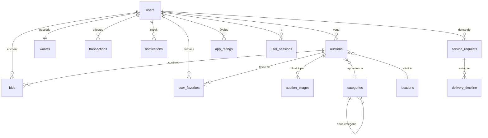

# 🔨 MazadPay — منصة المزادات الذكية

<p align="center">
  <strong>MazadPay</strong> est une plateforme d'enchères en ligne conçue pour le marché mauritanien.<br/>
  Elle permet aux utilisateurs d'acheter et de vendre des biens via un système de mise en temps réel,<br/>
  avec intégration des passerelles de paiement locales (Bankily, Masrivi, Sedad, Click).
</p>

---

## 📋 Table des Matières

- [Aperçu du Projet](#-aperçu-du-projet)
- [Architecture Technique](#-architecture-technique)
- [Fonctionnalités](#-fonctionnalités)
- [Structure du Projet](#-structure-du-projet)
- [Schéma de Base de Données](#-schéma-de-base-de-données)
- [Endpoints API](#-endpoints-api)
- [Installation & Lancement](#-installation--lancement)
- [Technologies Utilisées](#-technologies-utilisées)
- [Roadmap](#-roadmap)

---

## 🎯 Aperçu du Projet

| Attribut | Détail |
|:---|:---|
| **Nom** | MazadPay (مزاد باي) |
| **Version** | 1.0.0 |
| **Plateforme** | Mobile (Flutter — Android & iOS) |
| **Backend** | Go (Golang) — En cours de développement |
| **Base de données** | PostgreSQL 15+ |
| **Marché cible** | Mauritanie (Nouakchott, Nouadhibou) |
| **Langues** | Arabe (RTL), Français, English |
| **Monnaie** | MRU (Ouguiya mauritanien) |

---

## 🏗 Architecture Technique

```
┌─────────────────────────────────────────────────────────┐
│                    APPLICATION MOBILE                    │
│                   Flutter + Riverpod                     │
├─────────────────────────────────────────────────────────┤
│          REST API (HTTPS)    │    WebSocket (WSS)        │
├──────────────────────────────┼──────────────────────────┤
│                     BACKEND GO                          │
│  ┌──────────┐ ┌───────────┐ ┌───────────┐ ┌──────────┐ │
│  │   Auth   │ │  Auction  │ │  Payment  │ │ Realtime │ │
│  │ Service  │ │  Service  │ │  Service  │ │ Service  │ │
│  └──────────┘ └───────────┘ └───────────┘ └──────────┘ │
│  ┌──────────┐ ┌───────────┐ ┌───────────┐ ┌──────────┐ │
│  │  Media   │ │   Notif   │ │   Cron    │ │  Admin   │ │
│  │ Service  │ │  Service  │ │  Service  │ │ Service  │ │
│  └──────────┘ └───────────┘ └───────────┘ └──────────┘ │
├─────────────────────────────────────────────────────────┤
│   PostgreSQL   │   Redis (Cache)   │   MinIO (Media)    │
└─────────────────────────────────────────────────────────┘
```

### Services Backend

| Service | Rôle | Technologie |
|:---|:---|:---|
| **Auth Service** | Inscription, OTP (WhatsApp/SMS), JWT, Sessions | Bcrypt + JWT + Redis |
| **Auction Service** | CRUD enchères, logique de mise atomique | PostgreSQL + Verrouillage optimiste |
| **Realtime Service** | Prix live, timer, notifications surenchère | Go WebSockets |
| **Payment Service** | Dépôt, retrait, validation admin | Transactions SQL atomiques |
| **Notification Service** | Push, in-app | Firebase Cloud Messaging |
| **Media Service** | Upload/Serve images et vidéos | MinIO / AWS S3 |
| **Cron Service** | Clôture auto enchères, nettoyage OTP | `robfig/cron` |
| **Admin Service** | Validation paiements, modération annonces | API REST |

---

## ✨ Fonctionnalités

### 🔐 Module 1 — Authentification & Onboarding (11 fonctionnalités)

| Fonctionnalité | Description |
|:---|:---|
| Splash Screen | Écran de chargement animé avec logo |
| Onboarding | Carrousel introductif pour les nouveaux utilisateurs |
| Sélection de langue | Arabe / Français / English |
| Termes & Conditions | Acceptation obligatoire avant utilisation |
| Inscription | Par numéro de téléphone + code PIN (4 chiffres) |
| Connexion | Téléphone + PIN |
| Sélecteur de pays | Code pays +222 (Mauritanie) |
| Envoi OTP | Via WhatsApp ou SMS avec timer de renvoi |
| Vérification OTP | Code à 6 chiffres avec limite de 3 tentatives |
| Mot de passe oublié | Réinitialisation via OTP |
| Déconnexion | Invalidation de la session JWT |

### 🏠 Module 2 — Page d'Accueil & Navigation (10 fonctionnalités)

| Fonctionnalité | Description |
|:---|:---|
| Bannières promotionnelles | Carrousel d'annonces dynamiques |
| Filtre par ville | Nouakchott / Nouadhibou |
| Liste d'enchères actives | Cards avec image, prix, timer |
| Indicateur "LIVE" | Badge animé sur les enchères en cours |
| Barre de recherche | Recherche textuelle avec filtres |
| Navigation Bottom Bar | 4 onglets + FAB central (créer annonce) |
| Menu latéral (Drawer) | Profil + navigation complète |
| Réseaux sociaux | Liens vers Facebook, Instagram, TikTok, Snapchat |
| Partage de l'app | Deep linking pour inviter des amis |
| Évaluation | Système de notation 1-5 étoiles + commentaire |

### 🔨 Module 3 — Système d'Enchères (17 fonctionnalités)

| Fonctionnalité | Description |
|:---|:---|
| Fiche détaillée | Galerie images/vidéos, description, spécifications |
| Compte à rebours | Timer temps réel (H:M:S) via WebSocket |
| Compteur de vues | Nombre de visiteurs de l'enchère |
| Compteur participants | Nombre d'enchérisseurs actifs |
| Numéro de lot | Identifiant unique par enchère |
| Détails techniques | Marque, modèle, année, km, carburant, transmission (JSONB) |
| Contact vendeur | Bouton d'appel direct |
| Toggle favori | Ajouter/retirer des favoris (❤️) |
| Placer une mise | Sheet en 2 étapes : montant → confirmation |
| Incrément +/- | Boutons pour ajuster le montant de la mise |
| Meilleur enchérisseur | Indicateur visuel si l'utilisateur mène |
| Historique des mises | Liste complète de tous les enchérisseurs |
| Résumé enchère | Statistiques : nb mises, nb participants, gagnant |
| Anonymisation | Numéros de téléphone masqués (####4709) |
| Page gagnant | Écran de félicitations avec confettis |
| Compléter paiement | CTA post-victoire pour finaliser l'achat |
| Partager le gain | Deep link pour partager sur les réseaux |

### 📝 Module 4 — Création d'Annonces (7 fonctionnalités)

| Fonctionnalité | Description |
|:---|:---|
| Sélection catégorie | Roue circulaire interactive (8 catégories) |
| Catégories | عقارات، سيارات، هواتف، الكترونيات، ساعات، دراجات، حيوانات، أثاث |
| Formulaire | Titre, description, prix de départ, téléphone |
| Sous-catégories | Sélection hiérarchique (catégorie → sous-catégorie) |
| Localisation | Sélection ville + quartier |
| Upload médias | Images + vidéos (max 5 fichiers) |
| Validation | Vérification des champs obligatoires |

### 💰 Module 5 — Portefeuille & Paiement (10 fonctionnalités)

| Fonctionnalité | Description |
|:---|:---|
| Affichage solde | Masquer/afficher avec icône visibilité |
| Passerelles de paiement | **Masrivi, Bankily, Sedad, Click** |
| Code marchand | Affichage du code 07755 pour paiement |
| Détails transaction | Date, statut, frais, montant total |
| Upload reçu | Photo du virement bancaire |
| Confirmation | Écran "قيد المراجعة" (en attente validation admin) |
| Retrait | Demande de récupération du montant d'assurance |
| Méthodes de retrait | Virement bancaire / Mobile Money |
| Confirmation retrait | Dialogue "traitement sous 24h" |
| CGV paiement | 5 clauses de termes et conditions |

### 👤 Module 6 — Gestion du Compte (8 fonctionnalités)

| Fonctionnalité | Description |
|:---|:---|
| Profil utilisateur | Avatar, nom complet, téléphone |
| Modification profil | Nom, email, ville |
| Photo de profil | Upload avec icône caméra |
| Changement PIN | Modification du code de sécurité |
| Notifications ON/OFF | Switch pour activer/désactiver |
| Mes Enchères | Liste avec statut (en tête / dépassé) |
| Mes Favoris | Grille avec bouton "Enchérir maintenant" |
| Mes Gains | Liste avec statut (payé / en attente) |

### 🚚 Module 7 — Services Logistique (6 fonctionnalités)

| Fonctionnalité | Description |
|:---|:---|
| Services transport | Livraison, Course, Inter-villes, Marchandises, Autre |
| Tracking livraison | Numéro de suivi (MP-XXXXX-YYYY) |
| Timeline statut | 4 étapes visuelles (reçu → préparation → expédié → livraison) |
| Adresse livraison | Affichage de l'adresse complète |
| Infos livreur | Nom, photo, boutons appel + chat |
| E-commerce | Module boutique en ligne (placeholder) |

### 🔔 Module 8 — Notifications & Support (6 fonctionnalités)

| Fonctionnalité | Description |
|:---|:---|
| 5 types de notifications | bid, win, payment, system, ad |
| Tout marquer comme lu | Action groupée |
| Contact WhatsApp | 47601175 |
| Contact Email | mazadpay@gmail.com |
| Centre de support | WhatsApp + Téléphone + Email |
| FAQ | Questions fréquentes avec réponses extensibles |

### 📚 Module 9 — Contenu & Éducation (5 fonctionnalités)

| Fonctionnalité | Description |
|:---|:---|
| Vidéos tutorielles | 5 sujets (paiement, enchères, réception, commissions, FAQ) |
| Lecteur vidéo | Play/pause, seek ±10s, barre de progression |
| À propos | Présentation de MazadPay |
| Politique de confidentialité | 5 sections légales |
| Version | Affichée dans le drawer (v1.0.0) |

---

## 📁 Structure du Projet

### Frontend (Flutter)

```
lib/
├── main.dart                          # Point d'entrée + Riverpod
├── core/
│   └── theme.dart                     # Thème global (couleurs, typographies)
├── models/
│   └── auction.dart                   # Modèles Auction + BidEntry
├── providers/
│   ├── auction_provider.dart          # État des enchères (Riverpod)
│   └── favorites_provider.dart        # Gestion des favoris
├── pages/
│   ├── login_page.dart                # Connexion / Inscription
│   ├── otp_entry_page.dart            # Vérification OTP
│   ├── start_bidding_page.dart        # Onboarding
│   ├── home_page.dart                 # Page d'accueil
│   ├── auction_details_page.dart      # Détails d'enchère
│   ├── auction_history_page.dart      # Historique des mises
│   ├── auction_winner_page.dart       # Page gagnant
│   ├── create_ad_start_page.dart      # Sélection catégorie (roue)
│   ├── create_ad_form_page.dart       # Formulaire d'annonce
│   ├── account_page.dart              # Espace compte
│   ├── account_profile_page.dart      # Profil utilisateur
│   ├── services_page.dart             # Services (livraison, taxi)
│   ├── delivery_details_page.dart     # Tracking livraison
│   ├── deposit_page.dart              # Dépôt (choix passerelle)
│   ├── payment_details_page.dart      # Détails paiement + upload reçu
│   ├── payment_success_page.dart      # Confirmation de paiement
│   ├── withdraw_page.dart             # Retrait d'assurance
│   ├── favorites_page.dart            # Mes favoris
│   ├── my_auctions_page.dart          # Mes enchères
│   ├── my_winnings_page.dart          # Mes gains
│   ├── notifications_page.dart        # Centre de notifications
│   ├── support_page.dart              # Centre de support
│   ├── how_to_bid_page.dart           # Tutoriels vidéo
│   ├── privacy_policy_page.dart       # Politique de confidentialité
│   ├── about_mazad_pay_page.dart       # À propos
│   ├── terms_page.dart                # Termes et conditions
│   └── language_page.dart             # Sélection de langue
└── widgets/
    ├── side_menu_drawer.dart           # Menu latéral
    ├── bid_action_sheet.dart           # Sheet de mise (2 étapes)
    ├── app_modals.dart                 # Modals (langue, note, contact)
    ├── auction_winner_dialog.dart      # Dialog de victoire
    ├── live_indicator.dart             # Badge "LIVE" animé
    ├── mazad_pay_logo.dart             # Logo MazadPay
    ├── media_picker_sheet.dart         # Picker images/vidéos
    └── success_dialog.dart             # Dialog de succès
```

### Backend (Go — Architecture Cible)

```
backend/
├── cmd/
│   └── server/
│       └── main.go                    # Point d'entrée du serveur
├── internal/
│   ├── models/                        # Structs Go (User, Auction, Bid...)
│   ├── handlers/                      # Handlers HTTP (controllers)
│   ├── services/                      # Logique métier
│   ├── repository/                    # Couche d'accès aux données (SQL)
│   ├── middleware/                    # Auth JWT, Rate Limiting, CORS
│   └── websocket/                    # Hub WebSocket temps réel
├── migrations/
│   └── 001_init.sql                   # Schéma SQL complet
├── pkg/
│   ├── config/                        # Configuration (env vars)
│   └── utils/                         # Utilitaires (hash, validation)
├── go.mod
└── go.sum
```

---

## 🗃 Schéma de Base de Données

### Tables (17)

| # | Table | Description | Clés |
|:--|:---|:---|:---|
| 1 | `users` | Profils utilisateurs | PK: `id` (UUID) |
| 2 | `otp_verifications` | Codes OTP hashés | FK: `phone` |
| 3 | `user_sessions` | Sessions JWT actives | FK: `user_id` |
| 4 | `categories` | Catégories hiérarchiques (auto-réf.) | FK: `parent_id` |
| 5 | `locations` | Villes et quartiers | — |
| 6 | `auctions` | Enchères avec verrouillage optimiste | FK: `seller_id`, `category_id`, `location_id` |
| 7 | `auction_images` | Médias des enchères | FK: `auction_id` |
| 8 | `bids` | Mises individuelles | FK: `auction_id`, `bidder_id` |
| 9 | `user_favorites` | Favoris (table de liaison) | PK composite: `(user_id, auction_id)` |
| 10 | `wallets` | Portefeuille avec verrouillage | PK: `user_id` |
| 11 | `transactions` | Journal financier immuable | FK: `user_id` |
| 12 | `notifications` | Alertes utilisateur | FK: `user_id` |
| 13 | `service_requests` | Demandes de livraison/taxi | FK: `user_id`, `driver_id` |
| 14 | `delivery_timeline` | Étapes de livraison | FK: `request_id` |
| 15 | `banners` | Bannières promotionnelles | — |
| 16 | `app_ratings` | Évaluations utilisateurs | FK: `user_id` |
| 17 | `faq_items` | Questions fréquentes | — |

### Diagramme Relationnel (ERD)



### Contraintes de Sécurité

```sql
-- Solde ne peut jamais être négatif
CONSTRAINT chk_wallet_balance CHECK (balance >= 0)

-- Montant gelé ne peut jamais être négatif
CONSTRAINT chk_wallet_frozen CHECK (frozen_amount >= 0)

-- Prix actuel ≥ prix de départ
CONSTRAINT chk_auction_prices CHECK (current_price >= start_price)

-- Incrément minimum > 0
CONSTRAINT chk_auction_increment CHECK (min_increment > 0)

-- Montant de mise > 0
CONSTRAINT chk_bid_amount CHECK (amount > 0)

-- Verrouillage optimiste (colonne `version`) sur auctions et wallets
```

---

## 🔌 Endpoints API

### Authentification

| Méthode | Route | Description |
|:---|:---|:---|
| `POST` | `/api/auth/register` | Inscription (téléphone + PIN) |
| `POST` | `/api/auth/login` | Connexion |
| `POST` | `/api/auth/logout` | Déconnexion |
| `POST` | `/api/auth/otp/send` | Envoyer un code OTP |
| `POST` | `/api/auth/otp/verify` | Vérifier le code OTP |
| `POST` | `/api/auth/reset-password` | Réinitialiser le PIN |
| `PUT` | `/api/auth/change-password` | Changer le PIN |

### Enchères

| Méthode | Route | Description |
|:---|:---|:---|
| `GET` | `/api/auctions` | Liste des enchères (filtres: status, city, category) |
| `GET` | `/api/auctions/:id` | Détails d'une enchère |
| `POST` | `/api/auctions` | Créer une nouvelle enchère |
| `POST` | `/api/auctions/:id/bids` | Placer une mise |
| `GET` | `/api/auctions/:id/bids` | Historique des mises |
| `POST` | `/api/auctions/:id/view` | Incrémenter les vues |
| `GET` | `/api/auctions/search` | Recherche textuelle |
| `WS` | `/ws/auction/:id` | WebSocket temps réel (prix, timer) |

### Utilisateur

| Méthode | Route | Description |
|:---|:---|:---|
| `GET` | `/api/users/me` | Mon profil |
| `PUT` | `/api/users/me` | Modifier mon profil |
| `POST` | `/api/users/me/avatar` | Upload photo de profil |
| `GET` | `/api/users/me/bids` | Mes enchères en cours |
| `GET` | `/api/users/me/favorites` | Mes favoris |
| `GET` | `/api/users/me/winnings` | Mes gains |

### Favoris

| Méthode | Route | Description |
|:---|:---|:---|
| `POST` | `/api/favorites/:auction_id` | Ajouter aux favoris |
| `DELETE` | `/api/favorites/:auction_id` | Retirer des favoris |

### Finance

| Méthode | Route | Description |
|:---|:---|:---|
| `GET` | `/api/wallets/me` | Mon solde |
| `POST` | `/api/transactions/deposit` | Initier un dépôt |
| `POST` | `/api/transactions/:id/receipt` | Upload reçu de paiement |
| `POST` | `/api/transactions/withdraw` | Demande de retrait |
| `GET` | `/api/transactions` | Historique des transactions |

### Notifications

| Méthode | Route | Description |
|:---|:---|:---|
| `GET` | `/api/notifications` | Mes notifications |
| `PUT` | `/api/notifications/read-all` | Tout marquer comme lu |

### Contenu

| Méthode | Route | Description |
|:---|:---|:---|
| `GET` | `/api/banners` | Bannières promotionnelles |
| `GET` | `/api/categories` | Liste des catégories |
| `GET` | `/api/tutorials` | Vidéos tutorielles |
| `GET` | `/api/faq` | Questions fréquentes |

---

## 🚀 Installation & Lancement

### Prérequis

- **Flutter** >= 3.19.0
- **Dart** >= 3.3.0
- **Go** >= 1.22 (backend)
- **PostgreSQL** >= 15 (base de données)

### Frontend (Flutter)

```bash
# Cloner le projet
git clone <repo-url>
cd MazadPay

# Installer les dépendances
flutter pub get

# Générer le code Riverpod
dart run build_runner build

# Lancer sur émulateur/device
flutter run
```

### Backend (Go) — *En cours de développement*

```bash
cd backend

# Installer les dépendances
go mod tidy

# Configurer la base de données
cp .env.example .env
# Éditer .env avec vos credentials PostgreSQL

# Lancer les migrations
psql -U postgres -d mazadpay -f migrations/001_init.sql

# Lancer le serveur
go run cmd/server/main.go
```

---

## 🛠 Technologies Utilisées

### Frontend

| Technologie | Usage |
|:---|:---|
| **Flutter 3.x** | Framework UI cross-platform |
| **Riverpod** | Gestion d'état réactive |
| **Google Fonts** | Typographie (Plus Jakarta Sans) |
| **Video Player** | Lecture de vidéos tutorielles |
| **Font Awesome** | Icônes réseaux sociaux |

### Backend (Cible)

| Technologie | Usage |
|:---|:---|
| **Go 1.22+** | Langage backend (haute concurrence) |
| **PostgreSQL 15** | Base de données relationnelle |
| **Redis** | Cache + Rate Limiting |
| **gorilla/websocket** | Enchères temps réel |
| **JWT (golang-jwt)** | Authentification stateless |
| **MinIO** | Stockage media (S3-compatible) |
| **Firebase FCM** | Push notifications |

---

## 📍 Roadmap

### Phase 1 — MVP Backend ✅ (En cours)
- [x] Analyse complète du frontend (67 fonctionnalités)
- [x] Conception du schéma SQL (17 tables)
- [x] Définition des endpoints API (~45 routes)
- [ ] Génération des structs Go
- [ ] Implémentation Auth Service (OTP + JWT)
- [ ] Implémentation Auction CRUD

### Phase 2 — Core Features
- [ ] Système de mise en temps réel (WebSocket)
- [ ] Logique de clôture automatique des enchères (Cron)
- [ ] Verrouillage optimiste pour la concurrence
- [ ] Upload & stockage des médias (MinIO)

### Phase 3 — Finance
- [ ] Système de portefeuille (balance + frozen)
- [ ] Intégration passerelles (Bankily, Masrivi, Sedad, Click)
- [ ] Panneau d'administration pour validation manuelle
- [ ] Historique des transactions

### Phase 4 — Communication
- [ ] Notifications push (Firebase FCM)
- [ ] Notifications in-app
- [ ] Intégration WhatsApp Business API

### Phase 5 — Services Complémentaires
- [ ] Module de livraison avec tracking
- [ ] Module e-commerce
- [ ] Système d'évaluation et de réputation

---

## 📊 Résumé Quantitatif

| Métrique | Total |
|:---|:---|
| Fichiers analysés | 32 |
| Fonctionnalités identifiées | 67 |
| Modules fonctionnels | 9 |
| Tables SQL | 17 |
| Index de performance | 11 |
| Endpoints API | ~45 |
| Services backend | 8 |
| Passerelles de paiement | 4 |
| Catégories d'enchères | 8 |
| Localisations référencées | 9 |

---

## 📄 Licence

Ce projet est propriétaire. Tous droits réservés © 2026 MazadPay.

---

<p align="center">
  <strong>MazadPay</strong> — زايد الآن لتكون الفائز الأقرب بالصفقة! 🔨
</p>
